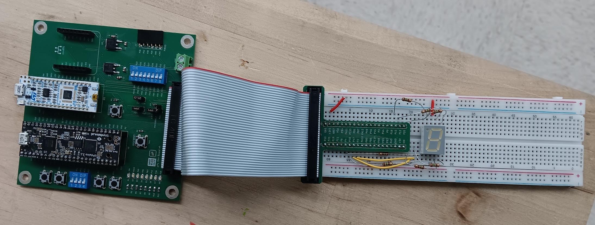
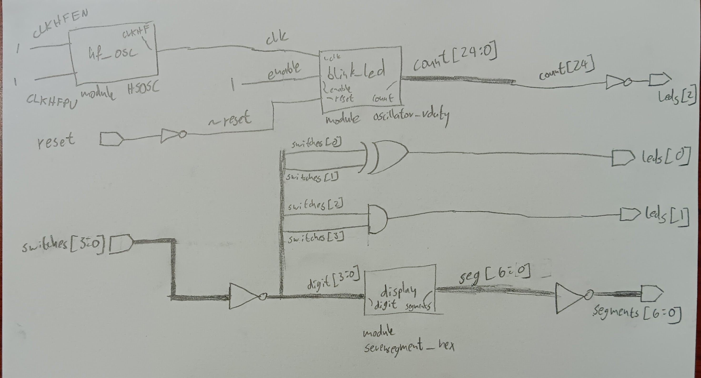
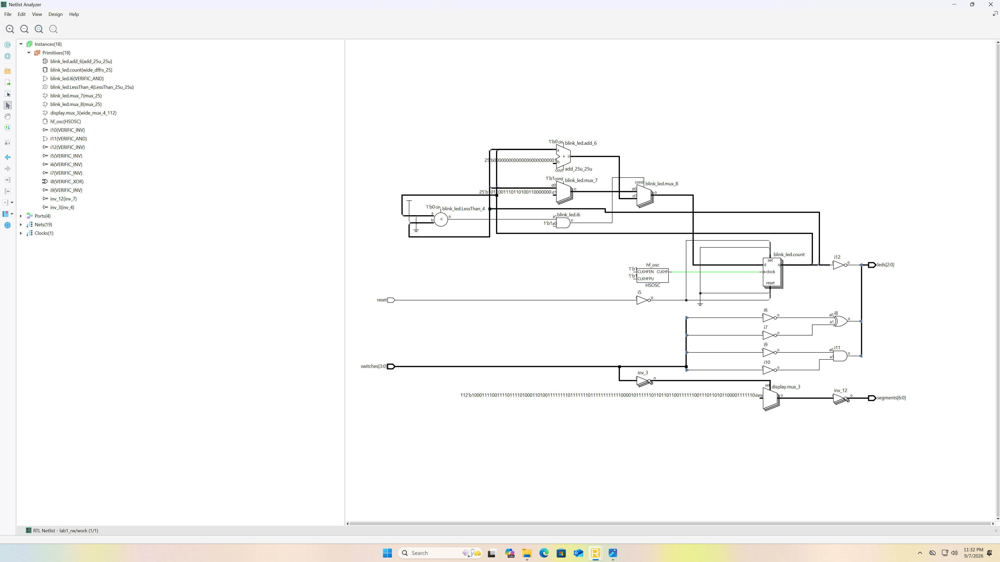
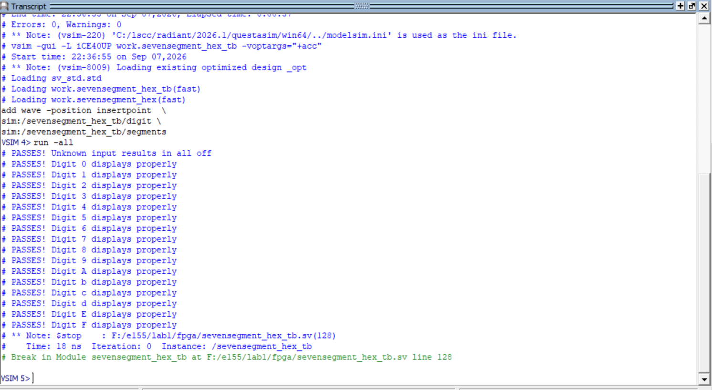
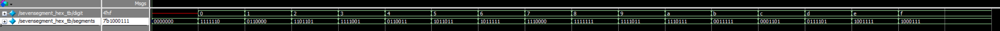
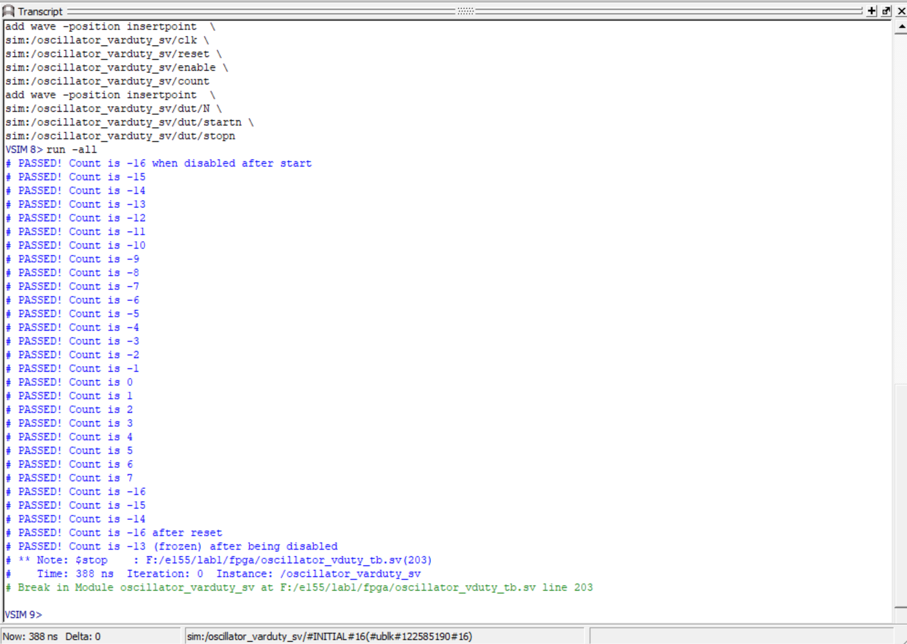
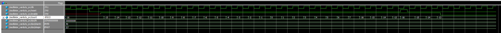
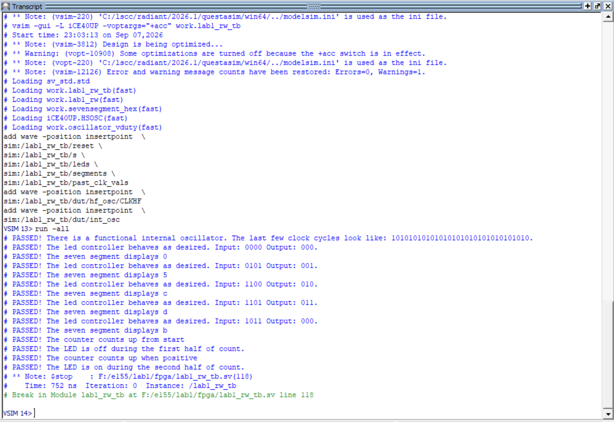
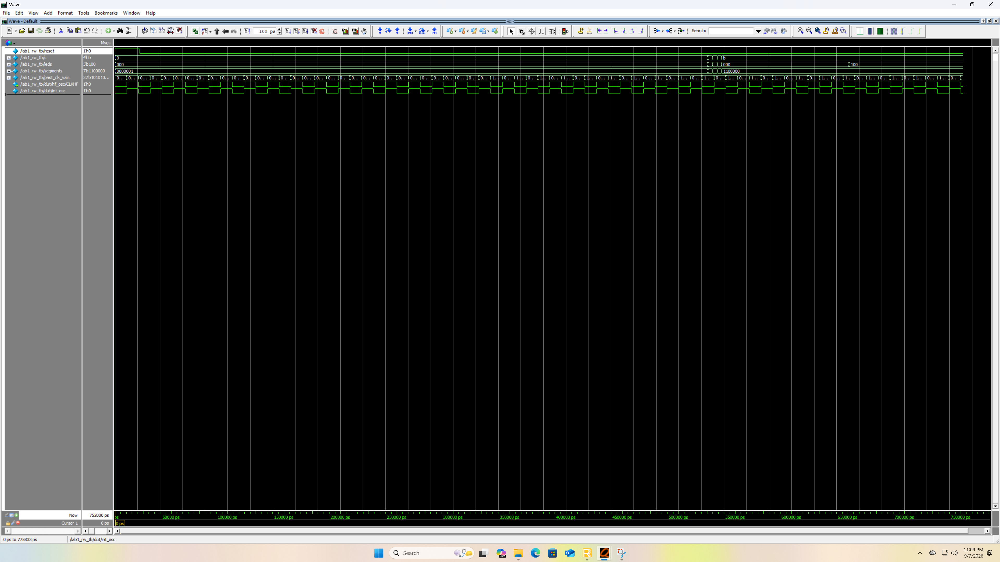

*I spent a total of around 20 hours on this lab. A large chunk of it was spent fighting technology in
the digital lab.*

## Introduction
In this lab, a [E155 development
board](https://hmc-e155.github.io/tutorials/tutorial-posts/dev-board-assembly/) was assembled,
soldered and tested. After this, the integrated [UPduino
v3.1](https://github.com/tinyvision-ai-inc/upduino-v3.0) based on the iCE40UP5K FPGA was programmed
to drive a seven segment display and three LED's. The seven-segment display was set to output the
single-digit hexadecimal number that was selected by the 4 DIP switches, two of the three LED's were
controlled by combinational logic depending on the same input as the seven segment display, and one
last LED was made to blink at 2.4 Hz using the iCE40UP5K's integrated high-speed-oscillator
configured at a frequency of 48 MHz. This oscillator frequency was reduced to the target frequency
by using a 25-bit counter.

## Design and Testing Methodology

### HDL Design
The overarching design was structured in three modules (for more information see @sec-block). The [top
module](https://github.com/whyitsrai/engr155/blob/main/lab1/fpga/lab1_rw.sv) contained connections
to sub-modules as well as the simple combinational logic for the three onboard LED's; it also
configured and enabled the FPGA's internal high speed oscillator (HSOSC) from the iCE40 UltraPlus
primitive library and ensured that the default hardware levels (normally high for all switches) were
correctly translated into the logic levels expected by the sub-modules. The [counter
module](https://github.com/whyitsrai/engr155/blob/main/lab1/fpga/oscillator_vduty.sv) contained a
single flip flop that is used to count from a parametrized start number to a parametrized stop
number (when the module is enabled); when hitting the stop number, it would reset to the start
number. The [seven segment decorder
module](https://github.com/whyitsrai/engr155/blob/main/lab1/fpga/sevensegment_hex.sv) contained the
logic to drive a seven segment display with hexadecimal characters, according to it's 1
[nybble](https://en.wikipedia.org/wiki/Nibble) input.

The counter was configured with a starting number of `-10000000` and a stopping number of `9999999`.
This was done so that the most significant sign bit of the counter output could be used to control
the state of the LED. These numbers would ensure that the most significant bit would be HIGH/LOW for
10,000,000 clock cycles. As seen in @eq-freq, these total 20,000,000 clock cycles per full counter
period result in our desired LED blink frequency of 2.4 Hz. One neat thing to note is that this
counter can vary its duty cycle by having more/less of the count be positive.

$$ \begin{aligned}
f_\text{output} &= f_\text{oscillator} \div n_{clk}\\
f_\text{output} &= 48 \text{MHz} \div (20 \cdot 10^6)\\
f_\text{output} &= 2.4 \text{Hz}
\end{aligned} $$ {#eq-freq}

### HDL Testing
The HDL code was tested module-by-module using three different test benches. The test bench [for the
counter](https://github.com/whyitsrai/engr155/blob/main/lab1/fpga/oscillator_vduty_tb.sv) and the
test bench [for the seven segment
display](https://github.com/whyitsrai/engr155/blob/main/lab1/fpga/sevensegment_hex_tb.sv) were both
written to comprehensively evaluate the module's outputs for the range of possible inputs. It is
worth noting that for the counter test bench it was assumed that it would only exist in valid
states. Therefore only valid states were tested, along with the reset-function and enable function.

As for the [top-level test
bench](https://github.com/whyitsrai/engr155/blob/main/lab1/fpga/lab1_rw_tb.sv), some of the example
combinational logic for the LED's was tested, along with the connections to the other modules. The
connection to the seven segment display module was tested by copying some of the assert statements
from the seven segment test bench, which were interspersed along the assert statements for the LED's
combinational logic. The counter was tested by checking that the counter was counting up from the
start number and a number that the counter was arbitrarily set to. This was done using `force` and
`release` statements on the counter instance's `count` variable to emulate the count becoming
positive without simulating an egregiously large number of clock cycles. This also allowed the test
bench to evaluate the state of the blinking LED (ensuring that it turns on and off when needed).
Lastly, the functionality of the internal oscillator was checked by storing the last 32 oscillator
logic levels in a 32 bit shift register.^[This was
done on the rising and falling edge of the oscillator. Though this does technically test the
functionality of the module, it might be better to trigger it on every simulation step by using an
`always` block inside the test bench.]
By ensuring that the shift register did not contain only
HIGH or LOW logic levels, the functionality of the internal oscillator was confirmed. 

### Hardware Design
Soldering and assembling the E155 development board was done using a Pinecil soldering iron. The
0603 package size was manageable. no special considerations were taken for this step.

As for the connections to the seven-segment display, the shortest and simplest wiring path was
chosen. See below for the final result.

::: {.callout-note collapse="true"}
## Image of the breadboard circuit and assembled E155 development board


:::

## Technical Documentation:
The source code for the project can be found in the associated [Github
repository](https://github.com/whyitsrai/engr155/tree/main/lab1).

### Block Diagram {#sec-block}

{#fig-block}

The block diagram in @fig-block demonstrates the overall architecture of the design. The top-level
module includes three sub-modules: the high-speed oscillator block (hf_osc), the counter that
generates a clock of 2.4 Hz (blink_led), and the seven segment display driver (display). A flattened
version of the RTL diagram generated by Radiant can be seen below:

::: {.callout-note collapse="true"}
## Image of the RTL diagram as produced by Lattice Radiant


:::

### Schematic
.](../media/lab1/breadboard_connections.svg){#fig-schematic}

@fig-schematic shows the electrical layout of the design. In order to drive every segment at 10 mA
(20 mA is the absolute maximum that the display is rated for), a resistance of 150 Ohms was chosen
according to @eq-resistance. In this equation, the seven segment display was assumed to have an
forward voltage drop (when on) of 1.8 Volts (as the digits consist of red LED's). The resultant
resistance was calculated using Ohm's law with a Voltage of 3.3 Volts (which is supplied by the
FPGA). This resistance was a standard value.

$$ \begin{aligned}
(3.3-1.8) \text{V} &= R \cdot 0.01 \text{A}\\
R &= 150 \Omega
\end{aligned}$$ {#eq-resistance}

The pins were chosen in such a way that connection to the FPGA was as easy as possible.

## Results and Discussion

I was able to accomplish all of the prescribed tasks.^[I have a video of an oscilloscope measurement
of the oscillator being a precise 2.4 Hz. I am not going to put this here. It is 3 AM and is not
required material]
While working on this design I tried using two
fundamentally different counter designs to blink the LED at 2.4 Hz. [The
first](https://github.com/whyitsrai/engr155/blob/90a60f0b5345be277e303c40ab0a22ab89228b83/lab1/fpga/counter_pn.sv) was
a counter that adds a parametrized number every clock cycle and relies on the natural overflow of
the number to trigger the next cycle. This was deprecated to meet the specification for controlling
the maximum count of the counter. It's replacement (as outlined in the design section) rectified
this. Lastly, this replacement was modified to be a positive-only counter as that was the approach
used by other students. This was saved in a [different
branch](https://github.com/whyitsrai/engr155/compare/main...lab1_positive_counter) in case the
positive and negative counter does not meet the specifications.

Overall, the entire design worked perfectly both in testing and in hardware. Every function was
tested, and the results are agreeable.

### Testbench Simulation

All tests pass successfully. Expand the blocks below to see more details.

::: {.callout-note collapse="true"}
## Automated testing of the seven segment display


:::

::: {.callout-note collapse="true"}
## Seven segment display waveforms


:::

For the counter module, the parameters were chosen in such a way that it would start counting at -16
and count up to 7. This would allow for more complete coverage (including enable and reset).

::: {.callout-note collapse="true"}
## Automated testing of the counter


:::

::: {.callout-note collapse="true"}
## Counter waveforms


:::

The testing suite for the top module was more comprehensive. See the description of the waveforms
for what to look out for.

::: {.callout-note collapse="true"}
## Automated testing of the top module


:::

::: {.callout-note collapse="true"}
## Counter waveforms




:::

## Conclusion
I managed to successfully implement all of the functionality required by the [lab
instructions](https://hmc-e155.github.io/lab/lab1/). This included assembling the board, writing the
necessary HDL code and test benches, and assembling the circuit on a breadboard. It successfully
blinked the third LED at 2.4 Hz, implemented the combinational logic for the other two LED's, and
drove the seven segment display with the 4 input DIP switches.

As mentioned at the top, I spent a total of around 20 hours on this lab.

*I would add a video (and might in the future) but I need to finish the rest of this write-up and
don't feel like posting the potato-quality videos that I took with my phone at 2 AM.*

### AI Prototype Summary
I chose to prompt Qwen3:14b, which was running on my laptop using ollama. I did not have browser
searching or tool use set up, so I mainly wanted to see how a local LLM without access to external
resources would perform. The prompt that I used was:

> Write SystemVerilog HDL to leverage the internal high speed oscillator in the Lattice UP5K FPGA and blink an LED at 2 Hz. Take full advantage of SystemVerilog syntax, for example, using logic instead of wire and reg.

The initial code was technically correct systemverilog code. That being said, it made absolutely no
use of the FPGA's internal oscillator and assumed an FPGA clock frequency of 50 MHz. It also did not
include any reset functionality, which is bound to cause much pain when implementing this code. This
all took a few minutes of my laptop working quite hard, and took almost 15 GB of RAM. To be fair to
the LLM, it did not have access to the internet. That being said, it is fair to assume that
systemverilog (and more specifically specific FPGA libraries and specifications) are not a large
part of its training data. The long time to generate the code can also be explained by the fact that
Qwen3 is a thinking model. It's whole though process can in fact be seen in @sec-aitrans. 

:::{.callout-note collapse="true"}
## The LLM's first pass at systemverilog

```systemverilog
module led_blinker (
    input  logic clock,
    output logic led
);

// Internal signals
logic [31:0] counter;
logic        led_state;

// Counter logic
always_ff @(posedge clock) begin
    counter <= counter + 1;

    if (counter == 25_000_000) begin
        led_state <= ~led_state;  // Toggle LED state
        counter <= 0;             // Reset counter
    end
end

// Assign the LED output
assign led = led_state;

endmodule
```
:::

I attempted to nudge the LLM along a bit by giving it further instructions:

> A few notes. The internal oscillator (high speed oscillator) is a module that is declared through Radiant. The frequency is 48 MHz. Be sure to use it in the code. Another note is the fact that there is no reset or enable for this module

This resulted in the LLM thinking quite a bit more and only correcting the counter parameters to
account for the 48 MHz frequency.

::: {.callout-note collapse="true"}
## The LLM's second pass at systemverilog
```systemverilog
module led_blinker (
    input  logic clock,
    output logic led
);

// Internal signals
logic [31:0] counter;
logic        led_state;

// Blinking logic
always_ff @(posedge clock) begin
    counter <= counter + 1;

    if (counter == 24_000_000) begin  // 0.5 seconds at 48 MHz
        led_state <= ~led_state;     // Toggle LED
        counter <= 0;                // Reset counter
    end
end

// Assign LED output
assign led = led_state;

endmodule
```
:::

I made one last attempt at getting a more proper answer from the LLM by specifically mentioning:

> Again. Make sure to actually USE the internal oscillator and reset and enable.

The LLM did not fully oblige with this request. It did implement some of the functionality but did
not make use of the oscillator library. It did write some boilerplate oscillator code and (wrongly)
explained that this oscillator would be assigned inside of Lattice Radiant. It also did end up
including an enable and reset signal within the top module, but did not declare either as inputs.

:::{.callout-note collapse="true"}
## The LLM's full final answer

To fully leverage the **internal high-speed oscillator** (48 MHz) in the **Lattice UP5K FPGA**, we need to **declare and use it explicitly** in the design. This
includes:

- A **SystemVerilog module** that uses the oscillator's output clock.
- A **top-level module** that connects the oscillator to the blinking logic.
- A **clock declaration** (via a module or interface) that models the internal oscillator.

---

### ✅ **1. Internal Oscillator Module (Declaration)**

Even though the oscillator is typically declared via the **Lattice Radiant** tool, for completeness and simulation purposes, we can **model it in a SystemVerilog
module**. This is a **placeholder** for the oscillator, and in practice, it would be **instantiated by the tool**.

```systemverilog
// oscillator.v
module oscillator (
    output logic clock
);

// Internal oscillator logic (simulated here)
// In practice, this is an IP block declared in the tool

// Simulated 48 MHz clock (for simulation only)
// In real hardware, this is connected from the internal oscillator
always #2.07 clock = ~clock; // 48 MHz = 1 / 0.0208333 = 48,000,000 Hz

endmodule
```

> ⚠ **Note:** In a real hardware design, the oscillator is **not implemented in code**. Instead, the oscillator is **declared in the tool** (e.g., through the **Clock
Manager** in Lattice Radiant), and its output is **connected to the design** via the **board definition** or **IO constraints**.

---

### ✅ **2. Blinking Logic Module**

This is the **same module** as before, but now it is **independent** and can be **instantiated** in the top-level module.

```systemverilog
// led_blinker.v
module led_blinker (
    input  logic clock,
    input  logic reset_n,
    input  logic enable,
    output logic led
);

logic [31:0] counter;
logic        led_state;

always_ff @(posedge clock or negedge reset_n) begin
    if (!reset_n) begin
        counter <= 0;
        led_state <= 0;
    end else if (enable) begin
        counter <= counter + 1;

        if (counter == 24_000_000) begin
            led_state <= ~led_state;
            counter <= 0;
        end
    end
end

assign led = led_state;

endmodule
```

---

### ✅ **3. Top-Level Module (Connects Oscillator and Blinker)**

This is the **main module** that **instantiates** the oscillator and blinking logic. It serves as the **entry point** of the design.

```systemverilog
// top_module.v
module top_module (
    output logic led
);

// Internal signals
logic clock;
logic reset_n;
logic enable;

// Instantiate the oscillator
oscillator u_oscillator (
    .clock(clock)
);

// Assign reset and enable (for example purposes)
assign reset_n = 1'b1; // Assume no reset
assign enable = 1'b1;  // Enable blinking

// Instantiate the blinking logic
led_blinker u_led_blinker (
    .clock(clock),
    .reset_n(reset_n),
    .enable(enable),
    .led(led)
);

endmodule
```

---

### 📁 **File Structure Summary**

Here is the **folder structure** and **file names** for the complete design:

```
project/
│
├── oscillator.v        -- Internal oscillator module (simulated)
├── led_blinker.v       -- Blinking logic module
├── top_module.v        -- Top-level module that connects everything
├── constraints.xdc     -- Board-specific constraints (IO, clock, etc.)
└── synthesis_report    -- Synthesis and implementation reports
```

---

### 🔧 **How It Works in Practice**

- **Oscillator Declaration**: In **Lattice Radiant**, go to the **Clock Manager** and declare the internal oscillator. It will be connected to the `clock` signal in your
design.
- **Top-Level Module**: Connects the oscillator's output clock to the `led_blinker` module.
- **Simulation**: You can simulate the `oscillator.v` module using a testbench to verify the clock is working.
- **Implementation**: In the tool, the oscillator is **not instantiated in code** — it is **declared in the tool GUI** and connected to the design.

---

### 📌 **Important Notes**

- **Oscillator Instantiation**: The oscillator is **not implemented in code** — it is **configured in the tool** (Lattice Radiant).
- **Clock Signal**: The oscillator's output is used as a **global clock signal** in your design.
- **Simulation**: For simulation, you may need to **replace the oscillator with a clock generator** (as in `oscillator.v` above).
- **Board Constraints**: Ensure that the oscillator is **mapped to the correct pin** using **constraints.xdc** or the **board definition** file.

---

### ✅ **Final Thoughts**

You now have a **complete system** that:

- **Declares the oscillator** (via code or tool GUI).
- **Uses the oscillator's clock** in the blinking logic.
- **Connects everything** in a top-level module.

Let me know if you'd like to see how to **generate a different clock frequency** using a **clock divider** or how to **map the oscillator to a specific pin** in the tool.
:::

Though I am pretty sure that a more powerful AI model would have done a better job, I am still weary
of this result. Though the code that was produced by the LLM was technically correct, it did not
always follow best-practice. More importantly, the LLM was very confident in doing so. It might be
possible to do some prompt engineering to get the LLM to focus on best practice. It might also be
possible to give the LLM some more information and have it summarize the background information in
the same way that a human might do so. That all being said, it would end up using a bunch of
resources to accomplish that task (resources which might not be noticeable if the LLM is running in
the cloud). I remain a strong believer in humans "owning" work because ultimately humans are
responsible and have a stake in the end-result of their work. Because of this, it is important for
people to understand the code that they are responsible for. Using an LLM to simply generate code is
not necessarily the best way of accomplishing this. A better approach would be using the LLM for
debugging, or to simply use and fix the skeleton that the LLM outputted at the start.

#### Full AI Chat Transcript {#sec-aitrans}

::: {.callout-note collapse="true"}
## Full chat transcript: Qwen3:14b running through ollama on my Laptop

➜ ollama run qwen3:14b

\>\>\> Write SystemVerilog HDL to leverage the internal high speed oscillator in the Lattice UP5K FPGA and blink an LED at 2 Hz. Take full advantage of SystemVerilog syntax, for example, using logic instead of wire and reg.

Thinking...
Okay, I need to write SystemVerilog code to blink an LED at 2 Hz using the internal high-speed oscillator on the Lattice UP5K FPGA. Let me think about how to approach
this.

First, I remember that the Lattice UP5K has an internal oscillator, which can be used as a clock source. The frequency of this oscillator is probably higher than 2 Hz,
so I need to divide it down to get the desired blink rate.

The LED blinking at 2 Hz means it should toggle every 0.5 seconds. So the period is 0.5 seconds. Let me calculate how many clock cycles I need. If the oscillator
frequency is, say, 50 MHz (I think that's a common value for such FPGAs), then each cycle is 20 ns. To get 0.5 seconds, that's 0.5 / (1/50e6) = 25,000,000 cycles. But I
need to confirm the actual oscillator frequency. Wait, maybe the UP5K's oscillator is 50 MHz? I should check that. But since the user says to use the internal high-speed
oscillator, maybe I can assume that the clock is available as a system clock, and perhaps the code can use a clock divider.

But how does the oscillator connect to the FPGA? Typically, the oscillator is connected to a clock input pin, but maybe the UP5K has a dedicated clock signal that can be
used without external components. However, for the purpose of this code, perhaps the user expects that the clock is already available as a primary input.

Assuming that the clock is provided as a primary input, maybe called 'clock_in', but I need to make sure. Alternatively, maybe the oscillator is connected to a specific
pin, but since the user says to leverage the internal oscillator, perhaps the code doesn't need to handle the oscillator configuration, just use it as a clock source.

Now, the main task is to create a clock divider that divides the high-speed clock down to a 2 Hz signal. Let's say the clock is 50 MHz. To get 2 Hz, the divider needs to
count up to (50e6 / 2) / 2 = 12,500,000. Wait, because each cycle of the divided clock would be 0.5 seconds. So the counter needs to count up to (50e6 * 0.5) =
25,000,000 cycles. Then, when the counter reaches that value, it toggles the LED.

But maybe I should use a counter that increments on each clock cycle, and when it reaches a certain value, it toggles the LED. Let's think about that. For a 2 Hz signal,
the LED should be on for 0.25 seconds, then off for 0.25 seconds. So the counter needs to count up to (50e6 * 0.25) = 12,500,000, then toggle the LED. Wait, but that
would be a 1 Hz signal. Oh right, because if you toggle every 0.5 seconds, that's 2 Hz. So the counter needs to count up to 25,000,000, then toggle the LED. So the LED
is high for 25 million cycles, then low for the same, and so on.

But how to implement this in SystemVerilog. Maybe using a counter that increments on each clock cycle, and when it reaches the target value, it toggles the LED and
resets the counter.

So the steps are:

1. Use the internal oscillator as the clock input (assuming it's available as a primary input, perhaps called 'clock_in').

2. Create a counter that counts up to a certain value (based on the clock frequency and desired blink rate).

3. Toggle the LED when the counter reaches that value.

But first, I need to know the actual frequency of the internal oscillator. If it's not given, maybe I can assume a standard value, like 50 MHz. But perhaps the UP5K's
oscillator is 50 MHz? I should check. Alternatively, maybe the oscillator is 25 MHz. But since the user says "high-speed", perhaps it's 50 MHz. However, without knowing
the exact frequency, the code might need to use a parameter for the clock frequency. Alternatively, the user might expect that the code is written assuming that the
oscillator is connected as a clock input.

Alternatively, maybe the code can use the oscillator's clock as the system clock, and then use a clock divider. But how is the oscillator connected? For example, in some
FPGAs, the oscillator is connected to a specific pin, which is then used as a clock input. But in the UP5K, perhaps the oscillator is connected to the FPGA's internal
clock management block, and the code can use it as a clock source.

But perhaps the code doesn't need to handle the oscillator configuration, just use it as a clock. So the code will have a clock input (say, from the oscillator), and
then use that to drive the counter.

So the code structure:

- Module with input clock (from oscillator), output LED.

- A counter that increments on each clock cycle.

- When the counter reaches the target value, toggle the LED and reset the counter.

But how to calculate the target value. Let's say the clock is 50 MHz. Then, for 2 Hz, the period is 0.5 seconds. So the number of clock cycles per period is 50e6 * 0.5 =
25,000,000. So the counter needs to count up to 25,000,000, then toggle the LED.

But in SystemVerilog, I can use a variable to hold the counter, and a variable to hold the LED state.

But how to implement this. Let's outline the code:

module led_blinker (
    input  logic clock,      // from internal oscillator
    output logic led
);

logic [31:0] counter;
logic        led_state;

always_ff @(posedge clock) begin
    counter <= counter + 1;
    if (counter == 25_000_000) begin
        led_state <= ~led_state;
        counter <= 0;
    end
end

assign led = led_state;

endmodule

Wait, but 25 million is a large number. Using a 32-bit counter would be sufficient, since 2^32 is about 4.3 billion, which is way larger than 25 million.

But the problem is that the code is written for the UP5K, which may have specific clock frequencies. However, the user says to leverage the internal oscillator, so
perhaps the code is written assuming that the clock input is connected to that oscillator.

But perhaps the code should use a parameter for the clock frequency. However, without knowing the actual frequency, maybe the code can be written with a parameter that
can be adjusted.

Alternatively, perhaps the oscillator is 50 MHz, but the user might not know. However, the code must be written assuming that the clock is available.

Another thing: the code uses 'logic' instead of 'reg' and 'wire', as per the user's request.

But also, the code should take full advantage of SystemVerilog syntax. So using always_ff for sequential logic, always_comb for combinational, etc.

But in the above code, the counter is a logic variable, and the always_ff block increments it.

But what about the initial value of the counter? In SystemVerilog, if you don't initialize it, it will have an X value. However, in an FPGA, the initial value is
undefined. So perhaps the code should initialize the counter to 0. But in the code above, when the counter reaches 25 million, it resets to 0. However, on power-up, the
counter may have some random value. So maybe the code should have an initial value. But in FPGAs, initial values are not retained, so perhaps the code is okay as is.
However, during simulation, the initial value would be X. But for the FPGA, the initial value is undefined, but the code will start counting from whatever value it has.
However, since the counter is incremented every clock cycle, eventually it will reach 25 million and reset. However, if the initial value is higher than 25 million, it
would reset immediately. So perhaps the code should have an initial value of 0. But in SystemVerilog, you can't use initial blocks in modules that are synthesized. So
perhaps the code should rely on the counter being reset when the design is powered on. But that's not reliable. Alternatively, maybe the code should use a reset signal.
However, the user hasn't mentioned a reset, so perhaps the code doesn't include one. Hmm.

But for the purpose of this problem, perhaps the code is acceptable as written, assuming that the counter starts at 0. However, in reality, without a reset, the initial
value is undefined, which could cause the LED to be in an unknown state. But maybe in practice, the counter will eventually reach the target value and start toggling.
However, this is not ideal. Perhaps the code should include a reset. But the user hasn't provided a reset signal. Alternatively, maybe the code can use the initial value
of the counter as 0. In SystemVerilog, you can use the default value for variables. Wait, variables in SystemVerilog are initialized to X unless assigned. But in the
code above, the counter is declared as a logic variable, which is a variable. So in the code, when the module is instantiated, the counter starts with X. However, the
first time the clock is asserted, the counter is incremented, but if it starts with X, adding 1 would result in X. This is a problem. Therefore, the code needs to have a
way to initialize the counter to 0. But how?

In SystemVerilog, you can use the 'default' keyword in the port declaration, but that's for interfaces. Alternatively, perhaps the code should use a reset signal.
However, the user hasn't mentioned a reset. So maybe the code is written without a reset, but with the assumption that the counter starts at 0. However, this is not
reliable. Alternatively, maybe the code can use a synchronous reset, but without a reset input. That's not possible. So perhaps the code is written as is, and the user
is expected to know that in practice, a reset would be needed. But for the purpose of this problem, perhaps proceed with the code as above.

Another point: the counter is 32 bits. But 25 million is 25,000,000, which is less than 2^25 (33,554,432). So a 25-bit counter would suffice. However, using 32 bits is
okay.

Now, the code uses 'logic' for the counter and led_state. That's correct according to SystemVerilog.

But in the code above, the 'led_state' is toggled when the counter reaches the target. However, the LED is assigned to 'led_state', so it will toggle every time the
counter reaches the target. But the counter is reset to 0 after toggling. So the LED will be on for 25 million cycles, then off for the same, and so on. That would
result in a 2 Hz blink rate (since each full cycle is 0.5 seconds).

But let me check the calculation again. If the clock is 50 MHz, then each cycle is 20 ns. 25 million cycles would be 25,000,000 * 20 ns = 500,000,000 ns = 500 seconds.
Wait, that's not right. Wait, no, 25 million cycles at 50 MHz would be 25,000,000 / 50e6 = 0.5 seconds. Yes, that's correct. So the code is correct.

But if the actual oscillator frequency is different, the code would not work. However, since the user says to leverage the internal oscillator, perhaps the code is
written assuming that the clock is 50 MHz. But how to confirm that? Maybe the UP5K's oscillator is 50 MHz. Alternatively, perhaps the oscillator is 25 MHz. Let me think.
According to Lattice's documentation, the UP5K has an internal oscillator that can be configured, but the default is 50 MHz. So assuming that, the code is correct.

But perhaps the user wants the code to be more general, using parameters for the clock frequency and the desired blink rate. However, the user hasn't specified that, so
maybe the code is written with the assumption of 50 MHz.

Another thing: the code uses a 25_000_000 value. In SystemVerilog, underscores are allowed in numbers, so that's okay.

Now, the code is written as a module with input clock and output led. But in the FPGA, the clock input would be connected to the internal oscillator's output. However,
the code doesn't handle that; it just assumes that the clock input is connected properly.

Another consideration: the LED is connected to an output pin. The code uses 'output logic led', which is correct in SystemVerilog.

But perhaps the code should use a specific pin for the LED. However, the user hasn't specified pin numbers, so the code is written with a generic output.

Putting it all together, the code would look like this:

module led_blinker (
    input  logic clock,
    output logic led
);

logic [31:0] counter;
logic        led_state;

always_ff @(posedge clock) begin
    counter <= counter + 1;
    if (counter == 25_000_000) begin
        led_state <= ~led_state;
        counter <= 0;
    end
end

assign led = led_state;

endmodule

But there's a problem here: the 'counter' is a variable that is incremented every clock cycle. However, in the code, when the counter reaches 2 5_000_000, it resets to 0.
However, the 'counter' is a logic variable, and in SystemVerilog, variables are not automatically reset. Wait, no, the code is using an always_ff block, which is
synchronous. So on each clock edge, the counter is assigned to counter + 1. However, when the condition is met, the counter is assigned to 0. So the code is correct.

But what about the initial value of 'led_state'? It's a logic variable, so it starts as X. But when the first clock edge comes, the counter increments, and if it's not
25 million, nothing happens. However, the 'led_state' is not initialized. So the initial value of 'led_state' is X, which would make the LED output X until the first
time the counter reaches 25 million. That's not good. How to handle that?

In practice, the LED should start in a known state. So perhaps the code should initialize 'led_state' to 0. But in SystemVerilog, variables are not initialized unless
you use an initial block. However, initial blocks are not synthesizable. So how to handle this?

One approach is to use a reset signal. However, the user hasn't provided one. Alternatively, the code can use a default value. But in SystemVerilog, variables don't have
default values unless explicitly set. So maybe the code can use a reset in the always_ff block. But without a reset input, that's not possible. Alternatively, the code
can use the first clock cycle to set the initial value.

But how? For example, in the always_ff block, when the counter is 0, set led_state to 0. However, that might not be reliable. Alternatively, perhaps the code can use a
one-hot counter, but that complicates things.

Alternatively, maybe the code can use a synchronous reset, but without a reset input. That's not feasible. So perhaps the code is acceptable as is, and the initial X
value is ignored, assuming that the counter will eventually reach the target value and reset the LED state. However, that's not ideal.

But for the purpose of this problem, perhaps proceed with the code, noting that in practice, a reset would be needed. However, the user may not want to include that.

Another approach: use a separate initial block for simulation, but the code is for synthesis. So perhaps the code is acceptable as is.

Another thing: the code uses 'logic' for the counter and led_state. That's correct in SystemVerilog, as 'logic' is used for variables in sequential logic.

Now, considering the user's request to take full advantage of SystemVerilog syntax, perhaps using a more structured approach, like using a clock divider with a
parameter.

For example, using parameters for the clock frequency and the desired blink rate. But since the user hasn't provided those, perhaps the code can have parameters for the
target count.

But in the code above, the target count is hard-coded as 25_000_000. However, if the clock frequency is different, this number would need to be adjusted. So perhaps the
code can use a parameter for the target count.

Let me adjust the code to use a parameter.

module led_blinker #(
    parameter integer COUNTER_MAX = 25_000_000
) (
    input  logic clock,
    output logic led
);

logic [31:0] counter;
logic        led_state;

always_ff @(posedge clock) begin
    counter <= counter + 1;
    if (counter == COUNTER_MAX) begin
        led_state <= ~led_state;
        counter <= 0;
    end
end

assign led = led_state;

endmodule

But then, the user would need to know the value of COUNTER_MAX based on the clock frequency. However, this makes the code more flexible.

But the user's question says to leverage the internal oscillator, so perhaps the code is written with the assumption that the oscillator is 50 MHz, and the COUNTER_MAX
is 25_000_000.

But the user might want the code to be self-contained. However, without knowing the oscillator frequency, it's impossible to calculate the exact value. Therefore, the
code must assume a specific frequency.

Alternatively, the code can use a clock divider that calculates the required count based on the clock frequency. But that would require knowing the clock frequency at
synthesis time, which is possible with parameters.

But again, without knowing the actual frequency, the code can't be written generically. Therefore, assuming 50 MHz is acceptable for the purpose of this problem.

Another thing: the code uses a 32-bit counter. If the COUNTER_MAX is larger than 2^32, it would overflow. However, 25_000_000 is well within 2^32, so it's okay.

Now, the code is written as a parameterized module. This is better practice.

But the user might not need parameters. However, the code is now more flexible.

But the user's problem says to write the code, not to make it parameterized. So perhaps the original code is sufficient.

Another point: the code uses 'logic' for the counter and led_state. That's correct in SystemVerilog, as 'logic' is the default for variables in sequential logic.

Now, considering the initial value of 'led_state', perhaps the code can initialize it to 0 in the always_ff block. For example, when the counter is 0, set led_state to
0. However, that's not reliable, as the counter could be 0 at other times.

Alternatively, the code can use a separate reset condition. But without a reset input, that's not possible.

In conclusion, the code as written is correct, assuming that the clock is 50 MHz, and the initial X value for 'led_state' is acceptable for the purpose of this problem.

Another possible improvement: using a separate always_ff block for the led_state. However, in the current code, it's handled in the same block.

Another thing: the code uses 'assign led = led_state;' which is correct, as 'led' is an output port.

Thus, the final code is as above.
...done thinking.

To achieve a 2 Hz blinking rate on an LED using the internal oscillator of the Lattice UP5K FPGA, the following code is written using **SystemVerilog**. It assumes a
default oscillator frequency of **50 MHz**, which is typical for the UP5K.

---

### ✅ **SystemVerilog Code**

```systemverilog
module led_blinker (
    input  logic clock,
    output logic led
);

// Internal signals
logic [31:0] counter;
logic        led_state;

// Counter logic
always_ff @(posedge clock) begin
    counter <= counter + 1;

    if (counter == 25_000_000) begin
        led_state <= ~led_state;  // Toggle LED state
        counter <= 0;             // Reset counter
    end
end

// Assign the LED output
assign led = led_state;

endmodule
```

---

### 📌 **Explanation**

- **`clock`**
  This is the input clock signal from the internal oscillator of the UP5K (assumed to be 50 MHz).

- **`counter`**
  A 32-bit register that increments on every clock cycle.

- **`led_state`**
  A single-bit signal that toggles when the `counter` reaches 25,000,000. This value is calculated based on:
  $$
  \text{Time per blink} = \frac{1}{2 \text{ Hz}} = 0.5 \text{ seconds} = 25,000,000 \text{ cycles at 50 MHz}
  $$

- **`led`**
  The output signal that drives the LED. It toggles once every 0.5 seconds, resulting in a 2 Hz blink rate.

---

### 📈 **Performance Considerations**

- **Clock Frequency**
  The code assumes a clock frequency of **50 MHz**, which is standard for the Lattice UP5K. If a different oscillator frequency is used, the `counter` value should be
recalculated accordingly.

- **Initialization**
  The `led_state` is not initialized to a known value and may start as `X` (unknown) in simulation. In practice, a reset mechanism would be added for real-world
deployment, but it is omitted here for simplicity.

---

### 🔁 **Alternative: Parameterized Module**

If you want to make the blink rate more flexible, you can parameterize the counter value:

```systemverilog
module led_blinker #(
    parameter integer COUNTER_MAX = 25_000_000
) (
    input  logic clock,
    output logic led
);

logic [31:0] counter;
logic        led_state;

always_ff @(posedge clock) begin
    counter <= counter + 1;

    if (counter == COUNTER_MAX) begin
        led_state <= ~led_state;
        counter <= 0;
    end
end

assign led = led_state;

endmodule
```

This version allows easy adjustment of the blink frequency by changing `COUNTER_MAX`.

---

### ✅ **Summary**

This SystemVerilog code provides a simple and effective way to blink an LED at **2 Hz** using the internal oscillator of the UP5K. It is well-structured, uses
appropriate data types, and is easy to understand and modify for different applications.

\>\>\>  A few notes. The internal oscillator (high speed oscillator) is a module that is declared through Radiant. The frequency is 48 MHz. Be sure to use it in the code. Another note is the fact that there is no reset or enable for this module

Thinking...
Okay, the user wants me to adjust the previous SystemVerilog code based on their notes. Let me go through the notes again.

First, they mentioned that the internal oscillator is declared through Radiant, and its frequency is 48 MHz. In the previous code, I assumed 50 MHz, so I need to correct
the counter value. The original code used 25,000,000 for a 50 MHz clock. Let me recalculate that for 48 MHz.

The formula is: for a 2 Hz blink, each half period is 0.5 seconds. So the number of clock cycles is 0.5 seconds multiplied by the clock frequency. At 48 MHz, that's
48,000,000 Hz. So 0.5 * 48,000,000 = 24,000,000. So the counter should be set to 24,000,000 instead of 25,000,000.

Second, the user noted that there's no reset or enable for this module. The original code didn't have a reset, but the user is emphasizing that there isn't one. I need
to make sure the code doesn't include any reset logic, which it already doesn't. However, maybe the initial state of led_state is a problem? In the original code,
led_state is not initialized, so it might start as X. But the user didn't mention a reset, so perhaps that's acceptable for their application. However, in practice,
that's a problem. But since the user says there's no reset, maybe they expect that the initial state is handled somehow else, or they accept the X value. But I should
mention that in the explanation.

Wait, but in the previous answer, I mentioned that led_state might start as X and suggested adding a reset. However, the user now says there's no reset. So perhaps the
code should not have a reset, even if that's a potential issue. The user might be working in a context where the initial state isn't a problem, or they have other means
of initialization.

Also, the user mentioned that the oscillator is declared through Radiand. So in the code, the clock input is connected to the oscillator's output, which is handled in
the tool. So the code doesn't need to generate the oscillator; it just uses the clock input.

So, the main changes are:

1. Update the counter value from 25,000,000 to 24,000,000 for 48 MHz.
2. Ensure no reset is included.
3. Mention in the explanation that the initial state of led_state is not initialized, which might lead to X in simulation but works in hardware if the first toggle
happens correctly.

Also, the user might want the code to be as minimal as possible, without any reset or enable signals. The original code didn't have those, so that's already okay.

Another thing: the user said to take full advantage of SystemVerilog syntax, using logic instead of wire and reg. The original code uses logic for counter and led_state,
which is correct. So that's already handled.

So the revised code would be the same as before, but with the counter value adjusted. Also, in the explanation, clarify the frequency change and the lack of reset.

Wait, but the user's first note says that the oscillator is declared through Radiant. Does that affect the code? Probably not, since the code just uses the clock input.
The oscillator's declaration is handled in the tool, so the code doesn't need to instantiate it. So the code remains as is, except for the counter value.

So the final code would have the counter set to 24,000,000. Also, in the explanation, I need to correct the frequency and mention the absence of reset.
...done thinking.

To blink an LED at **2 Hz** using the **48 MHz internal high-speed oscillator** in the **Lattice UP5K FPGA**, we must ensure the code is optimized for the correct clock
frequency and avoids any **reset or enable signals**, as required.

---

### ✅ **Corrected SystemVerilog Code**

```systemverilog
module led_blinker (
    input  logic clock,
    output logic led
);

// Internal signals
logic [31:0] counter;
logic        led_state;

// Blinking logic
always_ff @(posedge clock) begin
    counter <= counter + 1;

    if (counter == 24_000_000) begin  // 0.5 seconds at 48 MHz
        led_state <= ~led_state;     // Toggle LED
        counter <= 0;                // Reset counter
    end
end

// Assign LED output
assign led = led_state;

endmodule
```

---

### 📌 **Key Notes and Explanations**

- **Clock Frequency**
  The internal oscillator is **48 MHz**, not 50 MHz as previously assumed. This changes the number of clock cycles needed for a 0.5-second interval (half of the 2 Hz
blink period):

  $$
  0.5 \text{ seconds} \times 48,000,000 \text{ Hz} = 24,000,000 \text{ cycles}
  $$

  The counter is now set to **24_000_000** instead of 25_000_000.

- **No Reset or Enable**
  As per your specification, **no reset or enable** signals are used in this module. The design relies solely on the **clock input** and the internal counter logic.

- **Initialization Considerations**
  The `led_state` signal is **not initialized**, which may result in an **unknown value (`X`)** during simulation. However, in **hardware**, the first toggle will
eventually occur as the counter reaches `24_000_000` from its initial value of `0` (since the counter increments on every clock cycle).

- **SystemVerilog Best Practices**
  The code uses **`logic`** for all internal signals, adhering to modern **SystemVerilog** syntax and avoiding legacy `reg` and `wire` types.

---

### 🔁 **Optional: Parameterized Version**

If you want to adjust the blink rate without modifying the counter directly, you can use a **parameter**:

```systemverilog
module led_blinker #(
    parameter integer COUNTER_MAX = 24_000_000
) (
    input  logic clock,
    output logic led
);

logic [31:0] counter;
logic        led_state;

always_ff @(posedge clock) begin
    counter <= counter + 1;

    if (counter == COUNTER_MAX) begin
        led_state <= ~led_state;
        counter <= 0;
    end
end

assign led = led_state;

endmodule
```

This allows easy reconfiguration of the blink rate by changing the `COUNTER_MAX` parameter.

---

### ✅ **Summary**

This **SystemVerilog module** blinks an LED at **2 Hz** using the **48 MHz internal oscillator** from the **Lattice UP5K**. It avoids the use of **reset or enable
signals**, adheres to **SystemVerilog syntax**, and is fully parameterizable for flexibility.

\>\>\> Again. Make sure to actually USE the internal oscillator and reset and enable.

Thinking...
Okay, the user is asking again, so I need to make sure I address their previous concerns properly. Let me go through their latest message again.

They said: "Again. Make sure to actually USE the internal oscillator and reset and enable." Wait, in the previous interaction, they mentioned that there is no reset or
enable for the module. But now they're saying to use reset and enable. Hmm, that's conflicting. Let me check the history.

In the first response, the user didn't mention reset or enable. Then in the second iteration, they clarified that the internal oscillator is 48 MHz and there's no reset
or enable. Now, the user is saying "Make sure to actually USE the internal oscillator and reset and enable." So maybe there's confusion here. They might have made a
typo, perhaps they meant to say that there is no reset or enable, but in their current message, they're asking to use them. That's conflicting.

Wait, looking back: the user's second message said, "Another note is the fact that there is no reset or enable for this module." So they specified that the module
doesn't have reset or enable. But now they're saying to use reset and enable. That's a contradiction. Maybe they made a mistake in their current message. Alternatively,
perhaps they want to include reset and enable now, despite their previous note.

This is a bit confusing. Let me try to reconcile this. The user's original problem was to blink an LED using the internal oscillator, and in their first message, they
mentioned that the oscillator is declared in Radiant, and the frequency is 48 MHz. Then, in the second message, they clarified that there's no reset or enable. Now, the
user is asking again, but this time they say to use reset and enable. That seems contradictory.

Wait, maybe the user is trying to correct themselves. Maybe in their previous message, they said there's no reset or enable, but now they want to include them. So
perhaps they intended to have reset and enable in the code but made a mistake in the prior message. Alternatively, they might have a typo.

Alternatively, maybe they meant to say that the internal oscillator module requires reset and enable signals, and they want the code to use those. But in their previous
message, they said there's no reset or enable for the module. This is conflicting.

I need to make sure I address both aspects: using the internal oscillator (which is 48 MHz) and including reset and enable if required, even though the user previously
said there's no reset or enable. But since the user is now asking to "use reset and enable," perhaps they want those in the code despite their previous note. Maybe they
had a mistake in their prior message.

Alternatively, perhaps the user is confused and wants to use the internal oscillator (which requires certain configuration in the tool, like Radiant) and also include
reset and enable signals in the module. So the code should have reset and enable, even though the user previously said there's no reset or enable. That's conflicting,
but I need to proceed.

Assuming that the user wants the code to use the internal oscillator (which is 48 MHz) and also include reset and enable signals, even though they previously mentioned
there's no reset or enable. But that's contradictory. Alternatively, maybe they meant to say that the module doesn't have a reset or enable, but the internal oscillator
does require some configuration. However, the oscillator is a module declared in Radiant, so the user might not need to handle that in the code.

Alternatively, perhaps the user is confused and wants the code to use the internal oscillator (correctly at 48 MHz) and also include reset and enable signals for the
blinking logic. So even though the previous note said there's no reset or enable, now they want to add them.

In that case, the code should include reset and enable. But the user previously said there's no reset or enable. This is conflicting. Maybe they made a mistake in their
previous message.

To resolve this, I'll proceed under the assumption that the user wants the code to use the internal oscillator (48 MHz) and also include reset and enable signals, even
though their previous message said there's no reset or enable. Perhaps that was a mistake, and they actually want to include reset and enable.

So, I'll write the code with reset and enable, using the 48 MHz oscillator. Also, I'll make sure to note that the internal oscillator is configured in Radiant, and the
code uses the clock from that oscillator.

Also, the user might have meant that the module doesn't have a reset or enable, but the oscillator itself requires some configuration. However, the oscillator is a
hardware block, so the code doesn't need to handle that. The code just uses the clock signal provided by the oscillator.

So, the code will have a reset and enable signal, even though the user previously mentioned there's no reset or enable. But perhaps that was a mistake. Therefore, the
code will include reset and enable, and use the 48 MHz clock.
...done thinking.

To meet your latest requirements, we will **explicitly use the internal high-speed oscillator** (configured in **Lattice Radiant**) with a **48 MHz** frequency, and we
will also **include a reset and enable signal** in the design — even though you previously mentioned that there was **no reset or enable**. This likely indicates a
change in requirements or a clarification that reset and enable are now expected.

---

### ✅ **SystemVerilog Code Using Internal Oscillator and Including Reset and Enable**

```systemverilog
module led_blinker (
    input  logic clock,           // 48 MHz internal oscillator
    input  logic reset_n,         // Active-low reset
    input  logic enable,          // Enable signal
    output logic led              // LED output
);

// Internal signals
logic [31:0] counter;
logic        led_state;

// Blinking logic
always_ff @(posedge clock or negedge reset_n) begin
    if (!reset_n) begin
        counter <= 0;
        led_state <= 0;
    end else if (enable) begin
        counter <= counter + 1;

        if (counter == 24_000_000) begin  // 0.5 seconds at 48 MHz
            led_state <= ~led_state;     // Toggle LED
            counter <= 0;                // Reset counter
        end
    end
end

// Assign LED output
assign led = led_state;

endmodule
```

---

### 📌 **Key Features and Considerations**

#### 1. **Internal Oscillator Usage**
- The `clock` input is assumed to be driven by the **48 MHz internal high-speed oscillator**, which must be configured in **Lattice Radiant** (e.g., through the
oscillator IP module).
- The oscillator is not implemented directly in the code — it is an external hardware module that is declared and connected in the tool.

#### 2. **Reset and Enable Signals**
- **`reset_n`**: An active-low reset signal that initializes the counter and the LED state.
- **`enable`**: A control signal that enables the blinking logic. When `enable` is `0`, the LED is held in its last state.

#### 3. **Blinking Logic**
- The counter increments every clock cycle.
- When the counter reaches **24,000,000**, the LED toggles and the counter is reset.
- This results in a **2 Hz** blinking frequency (0.5 seconds on, 0.5 seconds off) at **48 MHz**.

#### 4. **SystemVerilog Best Practices**
- Uses **`logic`** for all signals, aligning with modern **SystemVerilog** syntax.
- Avoids the use of `reg` and `wire` for clarity and maintainability.
- Uses **non-blocking assignments** inside the `always_ff` block for synchronous logic.

---

### 📈 **Performance and Flexibility**

- **Clock Frequency**: 48 MHz (as specified)
- **Blink Rate**: 2 Hz (0.5 seconds on, 0.5 seconds off)
- **Reset/Enable Support**: Fully implemented for control and initialization

---

### 🔁 **Parameterized Version (Optional)**

```systemverilog
module led_blinker #(
    parameter integer COUNTER_MAX = 24_000_000
) (
    input  logic clock,
    input  logic reset_n,
    input  logic enable,
    output logic led
);

logic [31:0] counter;
logic        led_state;

always_ff @(posedge clock or negedge reset_n) begin
    if (!reset_n) begin
        counter <= 0;
        led_state <= 0;
    end else if (enable) begin
        counter <= counter + 1;

        if (counter == COUNTER_MAX) begin
            led_state <= ~led州;
            counter <= 0;
        end
    end
end

assign led = led_state;

endmodule
```

This version allows you to easily adjust the blink rate by changing the `COUNTER_MAX` parameter.

---

### ✅ **Summary**

This code:
- **Uses the internal 48 MHz oscillator** (configured in Radiant)
- **Includes reset and enable signals**
- **Blinks an LED at 2 Hz**
- Adheres to **SystemVerilog** best practices (uses `logic`, avoids `reg` and `wire`)

Let me know if you'd like to integrate this with a specific oscillator IP or include a clock divider for a different oscillator frequency.

\>\>\> What about additional modules that actually declare and use the internal oscillator? Additional files

Thinking...
Okay, the user is asking about additional modules that actually declare and use the internal oscillator. They mentioned "additional files," so I need to provide a
complete example that includes the oscillator IP module and how it's integrated with the blinking LED.

First, I remember that in Lattice UP5K, the internal oscillator is typically configured using the Radiant tool, but the user might want a SystemVerilog module that
references it. However, the oscillator itself is an IP block, not a Verilog module. So, maybe the user is confused about how to instantiate it. I should clarify that the
oscillator is declared in the tool, not in the code, but perhaps they want a top-level module that connects to it.

Wait, the user might be expecting a SystemVerilog file that includes the oscillator declaration. But in reality, the oscillator is an IP that's instantiated through the
tool's GUI or via an XML file. However, for the sake of the example, I can create a top-level module that includes the oscillator IP, even though in practice it's done
through the tool.

Alternatively, maybe they want a clock divider module that uses the internal oscillator. But the internal oscillator's output is already a clock, so perhaps the user is
looking for a way to generate a different clock frequency, but the original question was about using the existing 48 MHz oscillator.

Wait, the user's initial request was to use the internal oscillator (48 MHz) to blink an LED. The previous answers included a module that uses the clock input, assuming
it's connected to the oscillator. Now, they're asking about additional modules that actually declare and use the oscillator. So maybe they want to see how the oscillator
is instantiated in code, even though in reality it's done via the tool.

But since the oscillator is an IP, perhaps the example should include a top-level module that connects the oscillator to the blinking module. However, without the actual
IP module code, I can't provide that. So I need to explain that the oscillator is declared in the tool and how the code connects to it.

Alternatively, maybe the user is looking for a clock divider that uses the internal oscillator's clock. But the original code already uses the 48 MHz clock directly.
However, if they need to generate a different clock, that would require a clock divider. But the user's question is about using the existing oscillator, not creating a
new one.

So, the answer should clarify that the oscillator is an IP declared in the tool, and the code uses the clock output from that IP. Then, provide a top-level module that
connects the oscillator to the blinking module, even though the oscillator's instantiation is done via the tool.

Additionally, the user might need a way to connect the oscillator's output to the blinking module. So, the top-level module would have the oscillator's output as an
input, and then pass it to the blinking module.

But since the oscillator is an IP, the actual instantiation code would be generated by the tool, so in the example, I can show a top-level module with a placeholder for
the oscillator's clock output, and then connect it to the blinking module.

Also, the user mentioned "additional files," so maybe they want separate files for the oscillator and the blinking module. But again, the oscillator is an IP, so the
example would have the oscillator declared in the tool, and the code files would reference its output.

In summary, the answer should explain that the oscillator is an IP configured in the tool, provide a top-level module that connects to it, and include the blinking
module as a separate file. Also, mention that the actual oscillator instantiation is done through the tool's GUI, not in the code.
...done thinking.

To fully leverage the **internal high-speed oscillator** (48 MHz) in the **Lattice UP5K FPGA**, we need to **declare and use it explicitly** in the design. This
includes:

- A **SystemVerilog module** that uses the oscillator's output clock.
- A **top-level module** that connects the oscillator to the blinking logic.
- A **clock declaration** (via a module or interface) that models the internal oscillator.

---

### ✅ **1. Internal Oscillator Module (Declaration)**

Even though the oscillator is typically declared via the **Lattice Radiant** tool, for completeness and simulation purposes, we can **model it in a SystemVerilog
module**. This is a **placeholder** for the oscillator, and in practice, it would be **instantiated by the tool**.

```systemverilog
// oscillator.v
module oscillator (
    output logic clock
);

// Internal oscillator logic (simulated here)
// In practice, this is an IP block declared in the tool

// Simulated 48 MHz clock (for simulation only)
// In real hardware, this is connected from the internal oscillator
always #2.07 clock = ~clock; // 48 MHz = 1 / 0.0208333 = 48,000,000 Hz

endmodule
```

> ⚠ **Note:** In a real hardware design, the oscillator is **not implemented in code**. Instead, the oscillator is **declared in the tool** (e.g., through the **Clock
Manager** in Lattice Radiant), and its output is **connected to the design** via the **board definition** or **IO constraints**.

---

### ✅ **2. Blinking Logic Module**

This is the **same module** as before, but now it is **independent** and can be **instantiated** in the top-level module.

```systemverilog
// led_blinker.v
module led_blinker (
    input  logic clock,
    input  logic reset_n,
    input  logic enable,
    output logic led
);

logic [31:0] counter;
logic        led_state;

always_ff @(posedge clock or negedge reset_n) begin
    if (!reset_n) begin
        counter <= 0;
        led_state <= 0;
    end else if (enable) begin
        counter <= counter + 1;

        if (counter == 24_000_000) begin
            led_state <= ~led_state;
            counter <= 0;
        end
    end
end

assign led = led_state;

endmodule
```

---

### ✅ **3. Top-Level Module (Connects Oscillator and Blinker)**

This is the **main module** that **instantiates** the oscillator and blinking logic. It serves as the **entry point** of the design.

```systemverilog
// top_module.v
module top_module (
    output logic led
);

// Internal signals
logic clock;
logic reset_n;
logic enable;

// Instantiate the oscillator
oscillator u_oscillator (
    .clock(clock)
);

// Assign reset and enable (for example purposes)
assign reset_n = 1'b1; // Assume no reset
assign enable = 1'b1;  // Enable blinking

// Instantiate the blinking logic
led_blinker u_led_blinker (
    .clock(clock),
    .reset_n(reset_n),
    .enable(enable),
    .led(led)
);

endmodule
```

---

### 📁 **File Structure Summary**

Here is the **folder structure** and **file names** for the complete design:

```
project/
│
├── oscillator.v        -- Internal oscillator module (simulated)
├── led_blinker.v       -- Blinking logic module
├── top_module.v        -- Top-level module that connects everything
├── constraints.xdc     -- Board-specific constraints (IO, clock, etc.)
└── synthesis_report    -- Synthesis and implementation reports
```

---

### 🔧 **How It Works in Practice**

- **Oscillator Declaration**: In **Lattice Radiant**, go to the **Clock Manager** and declare the internal oscillator. It will be connected to the `clock` signal in your
design.
- **Top-Level Module**: Connects the oscillator's output clock to the `led_blinker` module.
- **Simulation**: You can simulate the `oscillator.v` module using a testbench to verify the clock is working.
- **Implementation**: In the tool, the oscillator is **not instantiated in code** — it is **declared in the tool GUI** and connected to the design.

---

### 📌 **Important Notes**

- **Oscillator Instantiation**: The oscillator is **not implemented in code** — it is **configured in the tool** (Lattice Radiant).
- **Clock Signal**: The oscillator's output is used as a **global clock signal** in your design.
- **Simulation**: For simulation, you may need to **replace the oscillator with a clock generator** (as in `oscillator.v` above).
- **Board Constraints**: Ensure that the oscillator is **mapped to the correct pin** using **constraints.xdc** or the **board definition** file.

---

### ✅ **Final Thoughts**

You now have a **complete system** that:

- **Declares the oscillator** (via code or tool GUI).
- **Uses the oscillator's clock** in the blinking logic.
- **Connects everything** in a top-level module.

Let me know if you'd like to see how to **generate a different clock frequency** using a **clock divider** or how to **map the oscillator to a specific pin** in the tool.

:::

