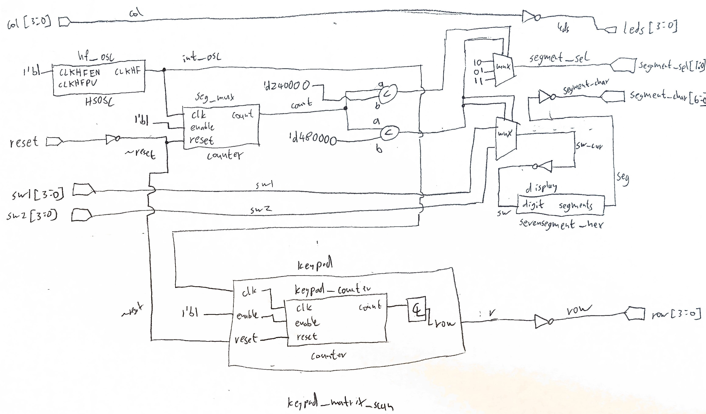
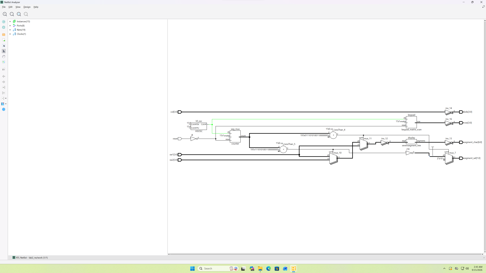
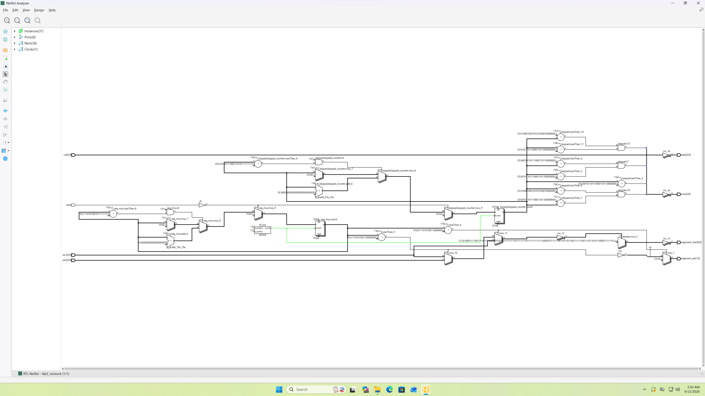
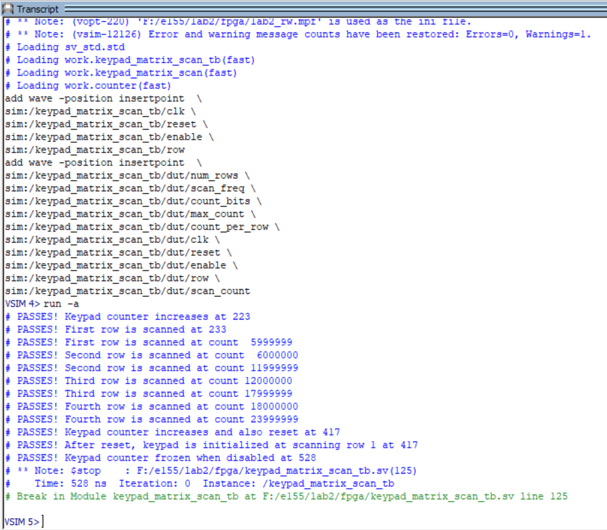
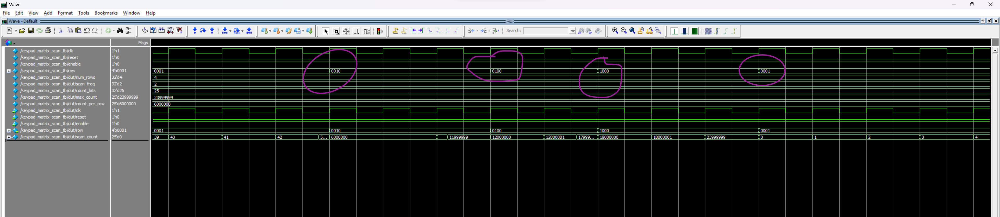
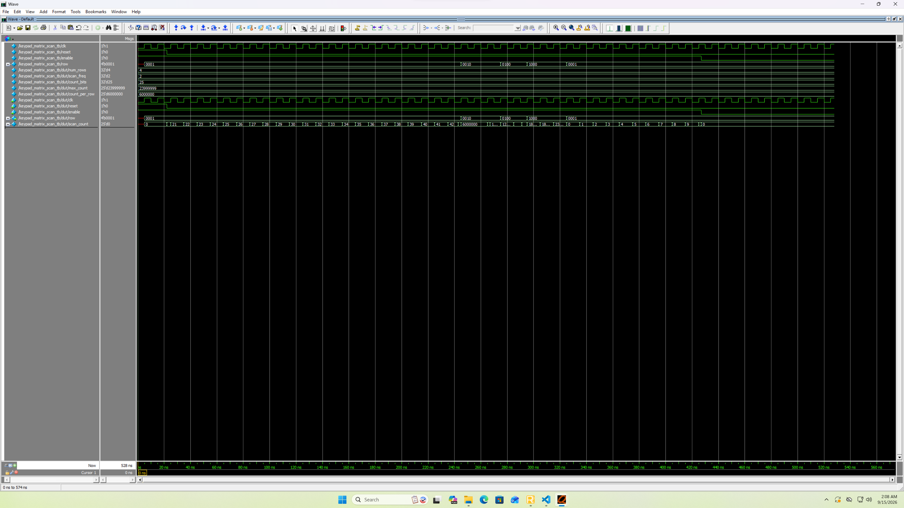
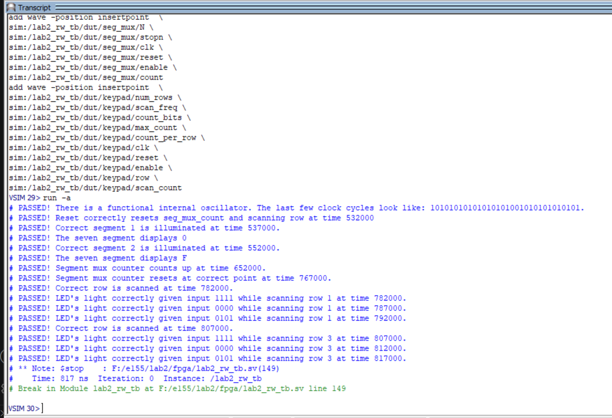
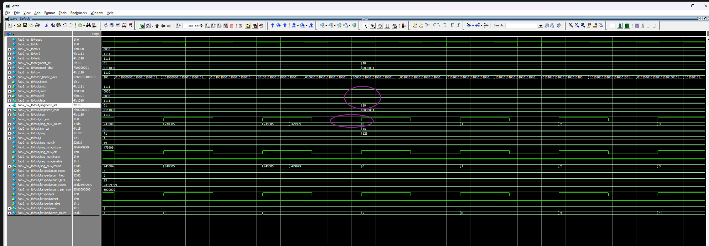
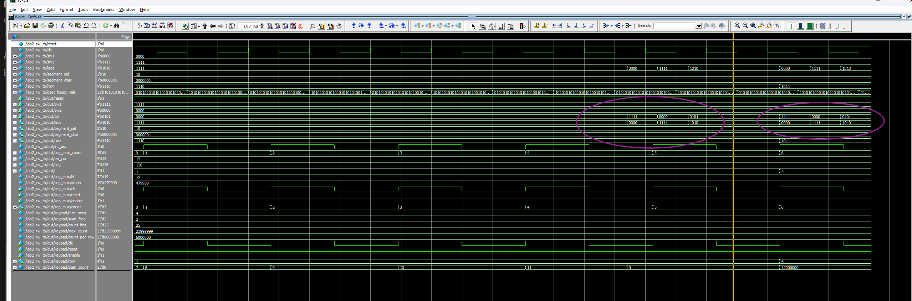
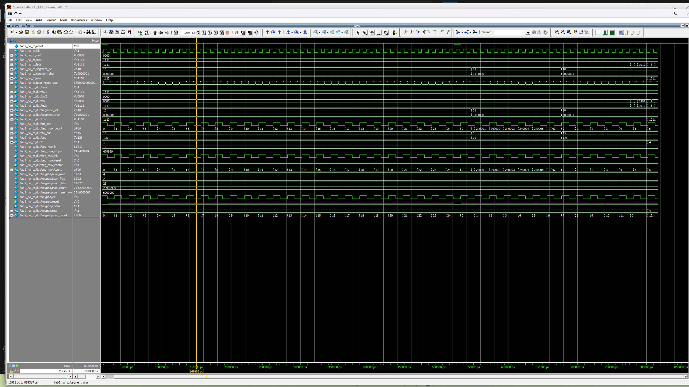

*I spent a total of around 14 hours on this lab. Trying to be clever takes extra time it appears
(i.e. make sure to read all of the specs and internalize them before starting a step).*

## Introduction
In this lab, a circuit that can read from a 4x4 keypad matrix and additionally multiplexes a
2-digit seven segment display was designed and built. After this, the integrated [UPduino
v3.1](https://github.com/tinyvision-ai-inc/upduino-v3.0) based on the iCE40UP5K FPGA was programmed
to scan across the rows of the keypad matrix at 2Hz and output the columns that are being pressed onto four
LED's. The FPGA was additionally programmed to drive the display with only 9 pins by multiplexing
its digits at 100Hz (with the digits being input by 2 DIP switches with 4 inputs each).

## Design and Testing Methodology

### HDL Design
The overarching design was structured in four modules (for more information see @sec-block). The [top
module](https://github.com/whyitsrai/engr155/blob/main/lab2/fpga/lab2_rw.sv) contained connections
to sub-modules as well as the combinational logic to multiplex the two seven segment displays; it also
configured and enabled the FPGA's internal high speed oscillator (HSOSC) from the iCE40 UltraPlus
primitive library and ensured that the default hardware levels (normally high for all switches) were
correctly translated into the logic levels expected by the sub-modules. The [keypad scanning
module](https://github.com/whyitsrai/engr155/blob/main/lab2/fpga/keypad_matrix_scan.sv) contained the
logic to scan any nxn keypad matrix by setting the rows to HIGH one at a time with a configurable
frequency. The [counter module](https://github.com/whyitsrai/engr155/blob/main/lab2/fpga/counter.sv) contained a
single flip flop that is used to repeatedly count from 0 to a parametrized stop
number (when the module is enabled). The counter is also used in the keypad sub-module. The [seven segment decorder
module](https://github.com/whyitsrai/engr155/blob/main/lab1/fpga/sevensegment_hex.sv) contained the
logic to drive a seven segment display with hexadecimal characters, according to it's 1
[nybble](https://en.wikipedia.org/wiki/Nibble) input.

Counters were configured to achieve their target frequency according to @eq-freq.

$$ \begin{aligned}
f_\text{output} &= f_\text{oscillator} \div n_{clk}\\
f_\text{output} &= 48 \text{MHz} \div n_{clk}
\end{aligned} $$ {#eq-freq}

### HDL Testing
The HDL code was tested module-by-module using two different new test benches (and one modified test
bench to ensure that the slightly modified counter from lab 1 was functioning). Those test benches
are [for the keypad
scanner](https://github.com/whyitsrai/engr155/blob/main/lab2/fpga/keypad_matrix_scan_tb.sv) and [for
the top module](https://github.com/whyitsrai/engr155/blob/main/lab2/fpga/lab2_rw_tb.sv). Both test
benches were comprehensive and tested every function that I could think of. This was again done by
partially using `force` and `release` statements and then asserting the outputs.

### Hardware Design
The keypad and seven segment display were wired up on a breadboard. The other components were either
already mounted on the PCB (one of the DIP switches, the LED's) and needed to be connected by
configuring a separate DIP switch with 8 connections, or were attached to an expansion header (the
other DIP switch) by soldering pins to them.

On the breadboard side, the display was multiplexed by having two independent PNP transistors
control the common anode of both of the digits. These transistors were configured to enter
saturation region when the FPGA output is LOW and were otherwise in their cutoff region. They were a
sort of high-side switch. Besides that, the keypad was connected to the FPGA through 4 silicone
diodes on its rows. The original instructions mentioned configuring the rows to be open-drain by
using an additional bank of NPN transistors, but this was not done in order to avoid some of the
complexity of building an additional transistor circuit (and also to experiment and see if it
works). Ultimately the functionality is identical.

For more details see the schematic in @sec-schematic.

::: {.content-hidden}
::::: {.callout-note collapse="true"}
## Image of the breadboard circuit and assembled E155 development board


:::::
:::

## Technical Documentation:
The source code for the project can be found in the associated [Github
repository](https://github.com/whyitsrai/engr155/tree/main/lab2).

### Block Diagram {#sec-block}

{#fig-block}

The block diagram in @fig-block demonstrates the overall architecture of the design. The top-level
module includes four sub-modules: the high-speed oscillator block (hf_osc), the counter that is
used to multiplex the two digits of the display (seg_mux), the seven segment display driver
(display), and the keypad row scanner (keypad) which itself includes an internal counter
(keypad_counter). The rest is made up of logic gates, muxes, and some combinational logic. THe
synthesis diagrams produced by Lattice Radiant are found below.

::: {.callout-note collapse="true"}
## Images of the RTL diagrams as produced by Lattice Radiant




:::

### Schematic {#sec-schematic}
.](../media/lab2/breadboard_connections.svg){#fig-schematic}

@fig-schematic shows the electrical layout of the design. In order to drive every segment at 10 mA
(20 mA is the absolute maximum that the display is rated for), a resistance of 150 Ohms was chosen
according to @eq-seg-resistance. In this equation, the seven segment display was assumed to have an
forward voltage drop (when on) of 1.8 Volts (as the digits consist of red LED's). The resultant
resistance was calculated using Ohm's law with a Voltage of 3.3 Volts (which is supplied by the
FPGA). This resistance was a standard value.

$$ \begin{aligned}
(3.3-1.8) \text{V} &= R \cdot 0.01 \text{A}\\
R &= 150 \Omega
\end{aligned}$$ {#eq-seg-resistance}

Additionally, the BJT gate resistor was set to be $330 \Omega$, which is the lowest standard
resistance that causes less than the 8mA maximum current^[A PNP BJT turns on when the voltage at the
base is below the voltage at the emitter. As this happens, more current is allowed to flow from the
base/emitter to the collector (which is the load). This allowed current is on the order of $\beta =
100$ times higher than the base current, but is not a precise value to rely on. For the sake of this
lab, driving the BJT into it's saturation (or completely on) region allows more than enough current
to flow for our needs.] that any GPIO pin on our FPGA can source/sink according to [section 4.17 of
the
datasheet](https://hmc-e155.github.io/assets/doc/FPGA-DS-02008-2-0-iCE40-UltraPlus-Family-Data-Sheet.pdf).
This calculation is shown in @eq-base-resistance. This is because the voltage at the base of the BJT
(when connected like shown above) is 0.7 Volts below it's emitter voltage of 3.3 Volts. Plugging our
resistance value and voltage between the emitter and ground (which is what the BJT base is pulled
down towards when it is turned on) into Ohms Law yields our result.^[Note that the BJT will not have
any reasonable amount of current flowing into the base when the base is biased higher than 2.6 Volts
as it will effectively be switched off.]

$$ \begin{aligned}
(3.3-0.7) \text{V} &= 330 \Omega \cdot I_\text{pin}\\
I_\text{pin} &= 7.88 \text{mA}\\
\end{aligned}$$ {#eq-base-resistance}

Lastly, note that the diode drop of 0.7V through the silicon diodes results in the input pins going
from 3.3V to 0.7V when the keys are pressed. This 0.7V is lower than $V_\text{IL} = 0.8V$ as
specified in [section 4.17 of the
datasheet](https://hmc-e155.github.io/assets/doc/FPGA-DS-02008-2-0-iCE40-UltraPlus-Family-Data-Sheet.pdf)
for our FPGA.


## Results and Discussion

I was able to accomplish all of the prescribed tasks. My *special sauce* that I added this time was
parametrizing the keypad scanning module using `genvar` and `for` loops to make it work with a
keypad matrix of any size. This took some extra time as I ended up having to re-write the test bench
to test 4x4 matrices as opposed to the 3x3 matrices that it was originally written for.^[Please
don't penalize me points-wise for using a for loop in my code. I know that the spec mentions that
only `assign` statements are allowed, but I promise that the actual logic is also just handled by
`assign` statements for me.]

Overall, the entire design worked perfectly both in testing and in hardware (excluding a few hiccups
along the way). Those hiccups were one of my PNP BJT's being damaged in such a way that caused one
of the segments to be less bright (and resulted in me re-wiring everything to use one 14 resistors
on the seven segment display as opposed to 7 resistors, which did not fix the problem), and the
other (much smaller) hiccup was my diode direction for the keypad initially being flipped. Every function was
tested, and the results are agreeable.

### Testbench Simulation

All tests pass successfully. Expand the blocks below to see more details.

The keypad was tested with a 4x4 matrix at 2Hz.

::: {.callout-note collapse="true"}
## Automated testing of the keypad scanning module


:::

::: {.callout-note collapse="true"}
## Keypad scanning module waveforms
Notice the rows that are being scanned changes based on the count.


Full capture

:::

::: {.callout-note collapse="true"}
## Automated testing of the top module


:::

::: {.callout-note collapse="true"}
## Top module waveforms
Notice that the segment selection BJT signal changes when then internal counter resets.


Notice the LED's changing state based on which columns are asserted.


Full capture

:::

## Conclusion
I managed to successfully implement all of the functionality required by the [lab
instructions](https://hmc-e155.github.io/lab/lab2/). As mentioned before, I deviated from the
instructions by using small diodes on the keypad as opposed to NPN transistors to form an open drain.
Ultimately the open drain design was necessary to avoid current from flowing from one FPGA output to
another one, which is very easy to accomplish with diodes.

As mentioned at the top, I spent a total of around 14 hours on this lab.

### AI Prototype Summary
I chose to prompt Google Gemini with the HMC education account. The initial prompt was was:

> Write SystemVerilog HDL to time multiplex a single seven segment decoder (that decodes from four
> bits to a common anode seven segment display) to decode two sets of input bits and drive two sets
> of seven output bits.


::: {.callout-note collapse="true"}
## Initial AI Response: Google Gemini Free (no thinking)

This SystemVerilog module uses a high-frequency clock to rapidly toggle between two 4-bit input values, driving a shared decoder and alternating the common anode enable signals so both displays appear continuously lit to the human eye.

```systemverilog
// SystemVerilog module to time-multiplex a single 7-segment decoder across two displays
module dual_seven_seg_multiplexer (
    input  logic       clk,         // System clock (e.g., 50 MHz or 100 MHz)
    input  logic       rst_n,       // Active-low asynchronous reset
    input  logic [3:0] in0,         // 4-bit input for Digit 0 (Right/LSB)
    input  logic [3:0] in1,         // 4-bit input for Digit 1 (Left/MSB)
    output logic [6:0] seg,         // Active-low 7-segment outputs {g, f, e, d, c, b, a}
    output logic [1:0] anode_en     // Active-low digit enables {Anode 1, Anode 0}
);

    // ------------------------------------------------------------------------
    // 1. Refresh Rate Prescaler
    // Generates a ~1 kHz multiplexing signal from a fast system clock.
    // ------------------------------------------------------------------------
    logic [15:0] refresh_counter;
    logic        sel; // Display select: 0 -> Digit 0, 1 -> Digit 1

    always_ff @(posedge clk or negedge rst_n) begin
        if (!rst_n) begin
            refresh_counter <= '0;
            sel             <= 1'b0;
        end else begin
            refresh_counter <= refresh_counter + 1'b1;
            // Toggle selection on counter roll-over (adjust bit index to match clock speed)
            if (refresh_counter == 16'd50_000) begin
                refresh_counter <= '0;
                sel             <= ~sel;
            end
        end
    end

    // ------------------------------------------------------------------------
    // 2. Input Multiplexer & Anode Selection
    // ------------------------------------------------------------------------
    logic [3:0] current_nibble;

    always_comb begin
        if (sel == 1'b0) begin
            current_nibble = in0;
            anode_en       = 2'b10; // Enable Digit 0 (Active-Low)
        end else begin
            current_nibble = in1;
            anode_en       = 2'b01; // Enable Digit 1 (Active-Low)
        end
    end

    // ------------------------------------------------------------------------
    // 3. Shared Hex to Common Anode Seven-Segment Decoder
    // Mapping: {g, f, e, d, c, b, a} — 0 enables segment, 1 disables segment
    // ------------------------------------------------------------------------
    always_comb begin
        case (current_nibble)
            4'h0: seg = 7'b100_0000;
            4'h1: seg = 7'b111_1001;
            4'h2: seg = 7'b010_0100;
            4'h3: seg = 7'b011_0000;
            4'h4: seg = 7'b001_1001;
            4'h5: seg = 7'b010_0010;
            4'h6: seg = 7'b000_0010;
            4'h7: seg = 7'b111_1000;
            4'h8: seg = 7'b000_0000;
            4'h9: seg = 7'b001_0000;
            4'hA: seg = 7'b000_1000;
            4'hB: seg = 7'b000_0011;
            4'hC: seg = 7'b100_0110;
            4'hD: seg = 7'b010_0001;
            4'hE: seg = 7'b000_0110;
            4'hF: seg = 7'b000_1110;
            default: seg = 7'b111_1111; // Off
        endcase
    end

endmodule
```
:::

The resulting code was all functional, with a few things to note. The first is that this piece of
code makes no use of our FPGA's high speed internal oscillator (though the LLM was not prompted to
do so). The second is the fact that the `Input Multiplexer & Anode Selection` section does not
include a default case for the combinational logic. To be fair, this default case should never be
activated given the current state of the code, BUT it is always good practice to include one in case
someone alters the code to produce a different result. In general, this code snippet is pretty good
but might cause problems down the line if it is blindly copy-pasted.

I then attached all of the [systemverilog files from lab
1](https://github.com/whyitsrai/engr155/tree/main/lab1/fpga), deleted the previous context, and prompted it:

> Write SystemVerilog HDL to time multiplex a single seven segment decoder (that decodes from four
> bits to a common anode seven segment display) to decode two sets of input bits and drive two sets
> of seven output bits. Use the seven segment decoder and oscillator provided in the attached files.

It's response was just a code snippet:

::: {.callout-note collapse="true"}
## Second Prompt AI Response: Google Gemini Free (no thinking)
```systemverilog
module time_mux_seven_seg (
    input  logic       reset,
    input  logic [3:0] in0,
    input  logic [3:0] in1,
    output logic [6:0] seg0,
    output logic [6:0] seg1
);

    logic        int_osc;
    logic [24:0] counter;
    logic [3:0]  mux_digit;
    logic [6:0]  raw_seg;

    // Internal High-Speed Oscillator instantiation
    HSOSC hf_osc (
        .CLKHFPU(1'b1),
        .CLKHFEN(1'b1),
        .CLKHF  (int_osc)
    );

    // Counter instantiation used to create a multiplexing clock/select signal[cite: 2, 4]
    oscillator_vduty #(
        .N     (25),
        .startn(-25'd10000000),
        .stopn (25'd9999999)
    ) mux_timer (
        .clk   (int_osc),
        .reset (reset),
        .enable(1'b1),
        .count (counter)
    );

    // Use the MSB (sign bit) as the multiplexing select signal[cite: 2, 4]
    logic sel;
    assign sel = counter[24]; // 0: select in0, 1: select in1

    // 2-to-1 Multiplexer for 4-bit decoder input
    assign mux_digit = sel ? in1 : in0;

    // Shared 7-segment hex decoder instance[cite: 2, 6]
    sevensegment_hex decoder (
        .digit   (mux_digit),
        .segments(raw_seg)
    );

    // Demultiplex and register/hold the decoded segment outputs for common anode displays
    // The decoder outputs active-HIGH signals (1 = segment ON)[cite: 6], 
    // but common-anode displays require inverted active-LOW signals (~raw_seg)[cite: 1, 2].
    always_ff @(posedge int_osc or posedge reset) begin
        if (reset) begin
            seg0 <= 7'b1111111; // All segments OFF for active-LOW output
            seg1 <= 7'b1111111;
        end else begin
            if (~sel) begin
                seg0 <= ~raw_seg;
            end else begin
                seg1 <= ~raw_seg;
            end
        end
    end

endmodule
```
:::

This result was far more interesting, though it still does not accomplish what I expected it to.
Firstly it mimicked a lot of the syntax that I used my previous lab (sans variable names). This
included using the most significant bit of the counter module to multiplex. For this lab I decided
to re-write the older counter module because it was more difficult to use (which also resulted in me
changing that most-significant-bit approach), but the LLM in no way suggested doing such. Again, it
was not prompted to do that, but it warrants being careful with using it. It is neat to see that the
LLM ended up using the internal high speed oscillator of the FPGA, BUT it also managed to stop
multiplexing the seven segment display output. It still contained the logic for flicking the digits
on and off, but the whole reason for multiplexing the display in the first place was to save some
pints. This code results in the FPGA requiring 7 more pins than is necessary. And the thing is, this
code is functional.

Overall, this tool is quite powerful to pre-process some code. At least, I can conclude as much by
looking at what it generated. As such, I can see it saving a lot of time. I can also see it as being
very easy to be lazy. I am currently having an experience of reading through a multi-thousand-line
AI generated codebase. It is a terrible experience because the LLM does not double-check its output
or change things as the scope or goals of a project change. The key difference between using an LLM
and googling stuff is the fact that the LLM produces code that technically works, but may not work
exactly in the way that you would like it to work. Next time I will see if `opencode` running on my
computer ends up being a bit more promising.

:::{.content-hidden}
#### Full AI Chat Transcript {#sec-aitrans}

::::: {.callout-note collapse="true"}
## Full chat transcript: Qwen3:14b running through ollama on my Laptop

:::::
:::
