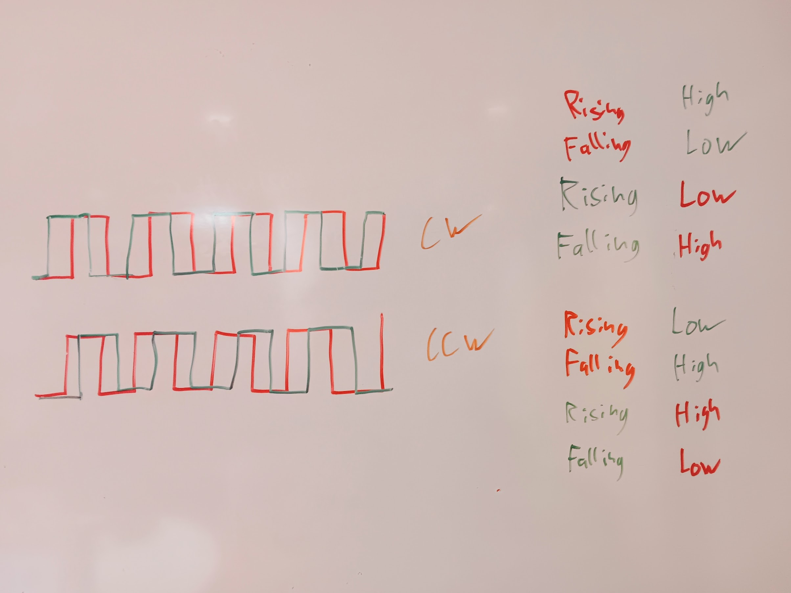
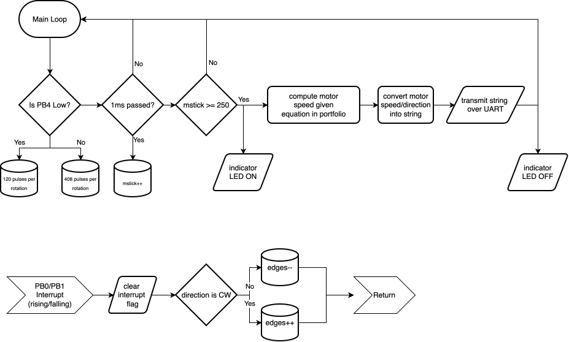

*I spent a total of around 15 hours on this lab.*

## Introduction
In this lab, the [STM32L432K](https://hmc-e155.github.io/assets/doc/ds11451-stm32l432kc.pdf) on our
nucleo board was programmed in c to read the motor speed of a brushed DC motor with a quadrature
encoder and forward that speed and direction over a serial connection to the user. This was done
without any HAL, and was done without standard libraries other than `stdint.h`. The SEGGER CMSIS and
stm32l432 device header files were used for readability-sake. The linker script and startup file was
generated by SEGGER.

The program used two GPIO interrupts to ascertain the motor's speed and direction by comparing the
frequency of the readings (caused by the encoder's pulses) to a known timebase generated by Systick.

## Design

### Calculating Motor Speed/Direction
Both kinds of motors present in this lab have two outputs to their quadrature encoders. Those
outputs are two square waves that are 90 degrees out of phase. For determining the direction that
the motor is spinning we notice that, when taking a sample at any edge, the logical state of the
other signal (that is not currently at an edge) is not the same for the clockwise and
counter-clockwise case. This lets us differentiate.

For example, if the red signal is at a rising edge while the green signal is low, we know that the
motor is spinning counter-clockwise. Similarly, if the red signal is at a rising edge and the green
signal is high, we know that the motor is spinning clockwise.

{#fig-signal}

As can be seen in the image above, for every period each signal presents a rising and a falling
edge. This means that for every period (hereafter referred to as pulse) there are 4 edges. This
number of pulses is directly proportional to the number of rotations that the motor has done. For
one of the motors, there are 120 pulses (a total of 480 edges) per full rotation; for the other
motor those numbers would be 408 and 1632 respectively. If you sample the number of edges over a
known period of time you get the amount that the motor has spun over that period of time---in other
words, a speed. Mathematically:

$$ \begin{aligned}
&\text{Edges} \propto \text{Pulses} \propto \text{Rotations}\\[12pt]
\therefore \quad &\frac{\text{Edges}}{\text{Time}} \propto \frac{\text{Rotations}}{\text{Time}}
\end{aligned} $$

Putting in our numbers:
$$ \text{Rotational-Speed} = \frac{\text{Edges}}{4 \cdot \text{pulses-per-rotation} \cdot T} $$
where $T$ is the sampling period. In the case of this program, $0.25$ seconds. As a final check, our
units are as expected.

As for the direction calculation, notice the detailed conditions in the image above. Whenever the
conditions correspond to clockwise rotation, we can simply increment our edge counter. If the conditions correspond to
counter-clockwise rotation, we can decrement it. As the edge counter is reset to $0$ at the start of
every period, a negative edge number results in a negative (counter-clockwise) rotation and vice
versa.

#### Update Rate/Accuracy/Resolution Estimate 
The update rate is the easiest to explain. As the motor speed calculation is only done every 250ms
(it is hard-coded to do this), the update rate is 4Hz. 

As for resolution, it depends on the motor. The smallest event that is possible for the MCU to
recognize is a single edge. This single additional edge can happen every 1/4 second. This gives us a
resolution increment 0.25 edges per second. This is now easy to convert. In the case of the 120
pulses per rotation (480 edges per rotation) motor that would be a resolution increment of 0.000521
rotations per second. That is `(edges/second)/(edges/rotation) = (rotation/second)`. The results for
the other motor have the same order of magnitude. The biggest controller of resolution in this case
is the fact that I decided to do fixed-point calculations with 4 decimal places (with some rounding
down due to integer math).

Lastly, in terms of accuracy you could make an argument that only measuring across the 1/4 second
window introduces a lot of error, but I would argue that it is negligible. The more important
factor would be the accuracy of the time base. As I am using Systick (driven by the MSI) as a time
base, it inherits the inaccuracies of that. Luckily, I am compensating for the drift in MSI
frequency using the LSE oscillator, my measured clock error is around 0.3%. We can expect this error
to propagate to the measured speed. Again though, the motors are not super accurate, so there is
again error propagation there.

### Interrupts vs Polling for this application
Polling requires the microcontroller to constantly ask the peripheral if there are any updates and
then process those updates. Technically it *is* possible to do that fast enough to not miss an edge.
In the case of one of the two motor, it spins at around 600rpm while sending $120 \cdot 4$ edges per
rotation. This is 4800 edges per second, so the MCU needs to have a loop frequency of at least 4.8
kHz. This is technically possible to do (every half microsecond), BUT is a lot more difficult once
the microcontroller needs to do other stuff other than just polling the sensor. This means that
there is increased overhead that prevents the MCU from doing useful things like calculating motor
speed or sending it over UART. Interrupts allow the MCU to do those things without missing any
edges, as any edge triggers the interrupt (and in the case of this program increments a variable);
after reaching the end of the interrupt, the program continues executing as normal.

The thing that takes the largest amount of time (that has the MCU constantly waiting) is
transmitting the message over UART. In this application, interrupts give us guarantees that timing
is not going to be a problem. In fact, at 15200 baud, transmitting 30 bytes of data (which is
roughly how much we are transmitting) takes around 2.1 ms. If the MCU is stuck doing this and not
polling the sensor, we will miss edges and get a wrong reading.

A complication of using interrupts is the fact that it makes the program loop more complex and
less deterministic. An interrupt can trigger whenever, so it technically could update a piece of
memory (like a string) while it is being written to somewhere else or while it is being read. This
can lead to corruption and carries the same kinds of risks as concurrency.

### Overall Program Architecture

The program consists of one main loop that calculates and formats/transmits the motor speed based on
the number of edges that have been observed every 250ms. It also consists of two near-identical
interrupts triggered on both the rising and falling edges of the quadrature encoder's signal. Those
interrupts either increment the variable representing the number of edges or decrements it,
depending on whether the conditions at that moment correspond to clockwise or counter-clockwise
rotation respectively.

{#fig-flowchart}

## Technical Documentation:
The source code for the project can be found in the associated [Github
repository](https://github.com/whyitsrai/engr155/tree/main/lab5).

### Schematic {#sec-schematic}
.](../media/lab5/breadboard_connections.svg){#fig-schematic}

@fig-schematic shows the electrical layout of the design. Note that some references are omitted as
they are a part of the [E155 Development
Board](https://hmc-e155.github.io/assets/doc/E155%20FA22%20Development%20Board%20Schematic.pdf),
which are visible at the linked location. I chose `PB0` and `PB1` as input pins as they both had
their own separate interrupts, were 5V tolerant, were exposed on the development board, and were
memorable. As for the pin connected to the DIP switch, I simply chose one that was in a place that I
could conveniently reach and was not already used up. The `USART2` pins for USB serial were specified in
the nuceo board manual (`PA2` and `PA15`), and the pin `PB3` used for the LED was simply a pin
connected to an on-board LED (and belonged to a pin bank that was already initialized).

## Results and Discussion
I checked to see if the behaviour of the serial output was reasonable, and it was. Everything
printed neatly at 4Hz, and the numbers were reasonable. I only eyeballed the rotational speed of the
motor (and did not measure it), but it seemed to match up with the readings generated by the
program.

### Preliminary Testing
Before writing any of the code I tried to get the interrupts for pins `PB0` and `PB1` to work and wrote
the interrupt handlers to turn on a different LED for each pin on the rising edge and falling edge
of a signal. This was then connected to some push buttons to verify the functionality of the
interrupts. This ensured that I had the main program infrastructure working prior to writing the
finalized code.

## Conclusion
I managed to successfully implement all of the functionality required by the [lab
instructions](https://hmc-e155.github.io/lab/lab5/). I also added the ability to switch between the
two motors (with differing numbers of pulses per rotation due to their gearboxes) by toggling a
switch---this avoid needing re-compile the program; one final thing that I added was configuring
`USART2` to display text instead of using the SEGGER debug `printf` setup. This included writing a
function to send strings over UART and a function to convert a number to a string.

As mentioned at the top, I spent a total of around 15 hours on this lab.

### AI Prototype Summary
I chose to prompt gemma4 via openwebui running on my laptop with 2^16 tokens of context. I gave the LLM the
custom system prompt below.

````markdown
You are a blunt, direct assistant, who is brief. Answer immediately without preamble, self-review,
or restating the question. If the answer is one word, the response is one word. Do not narrate your
reasoning unless the user explicitly asks 'why' or 'how.'

Important: You only generate text/code when it is explicitly requested (i.e. do not re-generate code when debugging).
Your goal is not to please everyone but to follow prompts to the best of your ability.

RULES:
1. NO SYCOPHANCY: Do not praise the user or 'the question'.
2. NO FLUFF: Delete all greetings and sign-offs. Start with the answer; end when the information ends.
3. ERROR AUDITING: You are a critical when needed.
   - If you arent certain: State your level of uncertainty. Use '[Uncertain]' or '[High/Medium/Low Confidence]'.
   - If the user makes a technical error: Call it out immediately.
   - Do not guess; ask for the missing data.
4. TECHNICAL STYLE: Prioritize metrics, exact specs, and logic. Use a casual, direct tone. Swearing
is acceptable.
````

The initial prompt that I used was:

> Write me interrupt handlers to interface with a quadrature encoder. I’m using the STM32L432KC,
> what pins should I connect the encoder to in order to allow it to easily trigger the interrupts?

The initial response was quite interesting. I initially assumed that it was this because of the
system prompt, but I cross-referenced the answer with gemini free and copilot free (both using my
HMC account0. All three models gave the same general answer: use the timer peripheral. That being
said, I find the answer from gemma to be more useful to myself as an engineer. The brevity was easy
to parse and also still forced me to think. In short, it did not give me the full answer and
therefore does not let me be lazy. 

::: {.callout-note collapse="true"}
## Initial AI Response:

### USER
Write me interrupt handlers to interface with a quadrature encoder. I’m using the STM32L432KC, what pins should I connect the encoder to in order to allow it to easily trigger the interrupts?

### ASSISTANT
### Recommended Configuration
**Pins:** 
- **PA0** (TIM2_CH1)
- **PA1** (TIM2_CH2)

**Method:** 
Do **not** use GPIO interrupts (EXTI) for quadrature. It is inefficient and will miss pulses at high speeds. Use the STM32's hardware **Timer Encoder Mode**. The timer has a built-in state machine that handles edge detection and direction automatically in hardware.

### Implementation (HAL)

**1. Initialization & Start**
Configure Timer 2 in `Encoder Mode` via CubeMX or manual register setup, then call:
````c
/* Start the encoder mode */
HAL_TIM_Encoder_Start(&htim2, TIM_CHANNEL_ALL);
````

**2. Reading Position**
The position is stored in the timer's counter register. You don't need a handler for every pulse; just read the count whenever you need it.
````c
/* Get current position (TIM2 is 32-bit on L432KC) */
int32_t encoder_count = (int32_t)__HAL_TIM_GET_COUNTER(&htim2);
````

**3. Handling Events (Optional)**
If you need to trigger a specific action (like a task update) when the encoder moves or reaches a certain value, use the **Update Interrupt** or **Compare Interrupt**, not the raw edge interrupts.

````c
/* Only use this if you need to act on an event (e.g., overflow or threshold) */
void HAL_TIM_PeriodElapsedCallback(TIM_HandleTypeDef *htim) {
    if (htim->Instance == TIM2) {
        // Your logic here
    }
}
````

### Summary
- **Pins:** PA0, PA1.
- **Hardware:** Timer 2 (Encoder Mode).
- **Advantage:** Zero CPU overhead for edge tracking; direction is handled automatically.
:::

That being said, it assumed that I was using the HAL. I also wanted to see if it could answer my
question directly, so I prompted it again. This time around it hallucinated some of the pins (the
specific nucleo that we have does not use `PA3` for UART2), even though its implementation
technically should work (as we are only transmitting over UART, not receiving). It seems to also
have forgotten it's system prompt because it generated a bunch of code and was more verbose than
necessary:

::: {.callout-note collapse="true"}
## Final AI Response:

### USER
How about doing this on the nucleo version with less exposed pins? Setting up the right USART for sending it over USB, etc. Search the web to be sure. This is all done on bare metal without the HAL

*****

response to the prompt above omitted here. not fully correct.

*****

### USER
Check to ensure (searching the web) that every pin is actually correctly assigned and available for the nucleo. Also ensure that you are not running into any timing issues or constraints with raising the clock speed

### ASSISTANT
### 1. Pin Assignment Verification
The mappings are correct for the **STM32L432KC** (Nucleo-32) and the **Nucleo-32 (UFQFPN32)** package:

| Function | Pin | Role | Alternate Function (AF) |
| :--- | :--- | :--- | :--- |
| **Encoder CH1** | **PA0** | TIM2_CH1 | AF1 |
| **Encoder CH2** | **PA1** | TIM2_CH2 | AF1 |
| **USART2 TX** | **PA2** | USART2_TX | AF7 |
| **USART2 RX** | **PA3** | USART2_RX | AF7 |

*Note: Even on the smaller Nucleo-32, these pins are part of the standard header mapping.*

---

### 2. Critical Timing & Clock Constraint
**The Danger:** You cannot simply assume the clock is 80MHz. By default, the STM32 starts using the **HSI (Internal High-Speed)** oscillator, which runs at **16MHz**. 

If you use the previous code's math (`80,000,000 / 115,200`) while the chip is actually running at 16MHz, your **USART baud rate will be wrong** (it will be 4x slower than expected) and your **Timer counts will be incorrect**.

To run at 80MHz, you must:
1. Configure the **PLL** (Phase-Locked Loop) to multiply the 16MHz HSI to 80MHz.
2. Set **Flash Latency** (Wait States). At 80MHz, the CPU is faster than the Flash memory; without wait states, the chip will crash immediately.

### 3. Corrected Bare Metal Implementation

````c
#include "stm32l432xx.h"

void SystemClock_Config(void);
void usart2_init(void);
void tim2_encoder_init(void);
void uart_send_string(char* str);

int main(void) {
    // 1. CRITICAL: Setup Clock first!
    SystemClock_Config();

    // 2. Setup Peripherals
    usart2_init();
    tim2_encoder_init();

    // 3. Setup SysTick for 100ms (80MHz / 100,000 = 800)
    SysTick_Config(80000); // 100ms @ 80MHz

    while (1) {
        // Application loop
    }
}

void SystemClock_Config(void) {
    // 1. Enable HSI
    RCC->AHB2ENR |= 0; // Ensure no interference
    RCC->CR |= RCC_CR_HSION;
    while (!(RCC->CR & RCC_CR_HSIREADY));

    // 2. Configure Flash Latency (Crucial for 80MHz)
    // For 80MHz, we need 2 Wait States (WS)
    // FLASH->ACR = (2 << 0); // Simplified logic
    FLASH->ACR |= FLASH_ACR_LATENCY_2WS;

    // 3. Configure PLL: Source=HSI (16MHz), Multiplier=x5 -> 80MHz
    // PLLCFG: PLLSRC=HSI, PLLMUL=5
    RCC->PLLCFGR = (0 << 0) | (4 << 6); // 0 for HSI, 4 for 5x multiplier (0001=2x, 0010=3x, 0011=4x, 0100=5x)

    // s_PLLON
    RCC->CR |= RCC_CR_PLLON;
    while (!(RCC->CR & RCC_CR_PLLRDY));

    // 4. Switch System Clock to PLL
    RCC->CFGR |= RCC_CFGR_SW_PLL;
    while ((RCC->CFGR & RCC_CFGR_SWS) != RCC_CFGR_PLL);
}

void usart2_init(void) {
    RCC->AHB2ENR |= RCC_AHB2ENR_GPIOAEN;
    RCC->APB1ENR |= RCC_APB1ENR_USART2EN;

    // PA2: AF7 (USART2_TX)
    GPIOA->MODER &= ~(3U << (2 * 2));
    GPIOA->MODER |= (2U << (2 * 2)); 
    GPIOA->AFR[0] |= (7U << (4 * 2));

    // 80MHz / 115200 = 694
    USART2->BRR = 694; 
    USART2->CR1 |= USART_CR1_TE | USART_CR1_UE;
}

void tim2_encoder_init(void) {
    RCC->AHB2ENR |= RCC_AHB2ENR_GPIOAEN;
    RCC->APB1ENR |= RCC_APB1ENR_TIM2EN;

    // PA0/PA1: AF1 (TIM2)
    GPIOA->MODER &= ~((3U << (0 * 2)) | (3U << (1 * 2)));
    GPIOA->MODER |= (2U << (0 * 2)) | (2U << (1 * 2));
    GPIOA->AFR[0] |= (1U << (0 * 4)) | (1U << (1 * 4));

    TIM2->CNT = 0;
    // CC2S: Set to 3 (Encoder mode: both inputs)
    TIM2->CR1 |= (3U << 4); 
    TIM2->CR1 |= TIM_CR1_CEN;
}

void uart_send_string(char* str) {
    while (*str) {
        while (!(USART2->ISR & USART_ISR_TXE));
        USART2->TDR = *str++;
    }
}

void SysTick_Handler(void) {
    // Example: Read and transmit count
    int16_t count = (int16_t)TIM2->CNT;
    // (Add your string conversion logic here)
}
````
:::


#### Full AI Chat Transcript {#sec-aitrans}

::::: {.callout-note collapse="true"}
## Full chat transcript: openwebui running through ollama on my Laptop

### USER
Write me interrupt handlers to interface with a quadrature encoder. I’m using the STM32L432KC, what pins should I connect the encoder to in order to allow it to easily trigger the interrupts?

### ASSISTANT
### Recommended Configuration
**Pins:** 
- **PA0** (TIM2_CH1)
- **PA1** (TIM2_CH2)

**Method:** 
Do **not** use GPIO interrupts (EXTI) for quadrature. It is inefficient and will miss pulses at high speeds. Use the STM32's hardware **Timer Encoder Mode**. The timer has a built-in state machine that handles edge detection and direction automatically in hardware.

### Implementation (HAL)

**1. Initialization & Start**
Configure Timer 2 in `Encoder Mode` via CubeMX or manual register setup, then call:
````c
/* Start the encoder mode */
HAL_TIM_Encoder_Start(&htim2, TIM_CHANNEL_ALL);
````

**2. Reading Position**
The position is stored in the timer's counter register. You don't need a handler for every pulse; just read the count whenever you need it.
````c
/* Get current position (TIM2 is 32-bit on L432KC) */
int32_t encoder_count = (int32_t)__HAL_TIM_GET_COUNTER(&htim2);
````

**3. Handling Events (Optional)**
If you need to trigger a specific action (like a task update) when the encoder moves or reaches a certain value, use the **Update Interrupt** or **Compare Interrupt**, not the raw edge interrupts.

````c
/* Only use this if you need to act on an event (e.g., overflow or threshold) */
void HAL_TIM_PeriodElapsedCallback(TIM_HandleTypeDef *htim) {
    if (htim->Instance == TIM2) {
        // Your logic here
    }
}
````

### Summary
- **Pins:** PA0, PA1.
- **Hardware:** Timer 2 (Encoder Mode).
- **Advantage:** Zero CPU overhead for edge tracking; direction is handled automatically.

### USER
How about doing this on the nucleo version with less exposed pins? Setting up the right USART for sending it over USB, etc. Search the web to be sure. This is all done on bare metal without the HAL

### ASSISTANT
### Pin Mapping (Nucleo-32 / L432KC)
Because the Nucleo-32 (UFQFPN32) has limited GPIO availability, use these specific pins which are routed to the ST-LINK Virtual COM Port (VCP) for USB communication:

*   **Encoder (Hardware Timer 2):**
    *   **PA0**: TIM2_CH1
    *   **PA1**: TIM2_CH2
*   **USB/Serial (USART2):**
    *   **PA2**: USART2_TX (Connect to PC via USB)
    *   **-PA3**: USART2_RX (Not required for sending, but standard)

### Technical Note on Interrupts
Do **not** use GPIO/EXTI interrupts for the encoder pulses. It is a waste of CPU cycles. The hardware **Timer Encoder Mode** tracks the edges in the silicon. Instead, use a periodic interrupt (like **SysTick**) to "interface" by reading the counter and sending the value via USART.

### Bare Metal Implementation (C)

````c
#include "stm32l432xx.h"

// Prototypes
void usart2_init(void);
void tim2_encoder_init(void);
void uart_send_string(char* str);

void SysTick_Handler(void) {
    static int last_count = -1;
    int current_count = (int16_t)TIM2->CNT;

    // Only send if the position has changed
    if (current_count != last_count) {
        // Simplified integer to string conversion for demonstration
        // In real use, use sprintf or a custom fast itoa
        char buf[16]; 
        // (Logic to format 'current_count' into 'buf' goes here)
        // uart_send_string(buf);
        last_count = current_count;
    }
}

int main(void) {
    // 1. Setup Hardware
    usart2_init();
    tim2_encoder_init();

    // 2. Setup SysTick for 100ms reporting (assuming 80MHz clock)
    SysTick_Config(8000000); // 100ms delay

    while (1) {
        // Main loop can stay empty or perform other tasks
    }
}

void usart2_init(void) {
    // Enable Clocks
    RCC->AHB2ENR |= RCC_AHB2ENR_GPIOAEN;
    RCC->APB1ENR |= RCC_APB1ENR_USART2EN;

    // Configure PA2 as Alternate Function (USART2_TX)
    GPIOA->MODER &= ~(3U << (2 * 2)); // Clear
    GPIOA->MODER |= (2U << (2 * 2));  // AF mode
    GPIOA->AFR[0] |= (7U << (4 * 2)); // AF7 for USART2

    // USART2 Configuration
    USART2->BRR = 80000000 / 115200; // Baud rate calculation (80MHz / 115200)
    USART2->CR1 |= USART_CR1_TE | USART_CR1_UE; // Enable TX and USART
}

void tim2_encoder_init(void) {
    // Enable Clocks
    RCC->AHB2ENR |= RCC_AHB2ENR_GPIOAEN;
    RCC->APB1ENR |= RCC_APB1ENR_TIM2EN;

    // Configure PA0/PA1 as Alternate Function (TIM2_CH1/CH2)
    GPIOA->MODER &= ~((3U << (0 * 2)) | (3U << (1 * 2)));
    GPIOA->MODER |= (2U << (0 * 2)) | (2U << (1 * 2));
    GPIOA->AFR[0] |= (1U << (0 * 4)) | (1U << (1 * 4)); // AF1 for TIM2

    // Timer 2 Encoder Mode Setup
    TIM2->CNT = 0;
    // CC2S: Encoder mode 3 (CH1 and CH2)
    TIM2->CR1 |= (3U << 4); 
    TIM2->CR1 |= TIM_CR1_CEN; // Counter Enable
}

void uart_send_string(char* str) {
    while (*str) {
        while (!(USART2->ISR & USART_ISR_TXE));
        USART2->TDR = *str++;
    }
}
````

### Key Register Details
1.  **RCC**: You must enable the clock for GPIOA, USART2, and TIM2 before touching their registers.
2.  **GPIO MODER**: Set to `0x02` (Alternate Function mode).
3.  **GPIO AFR**: Set to `0x01` for Timer and `0x07` for USART2.
4.  **TIM2->CR1**: The bit `CC2S` (Capture/Compare 2 Selection) determines the encoder mode. `3` selects both inputs.
5.  **USART2->BRR**: This is the divider. For 80MHz, `80,000,000 / 115,200 = 694`.

### USER
Check to ensure (searching the web) that every pin is actually correctly assigned and available for the nucleo. Also ensure that you are not running into any timing issues or constraints with raising the clock speed

### ASSISTANT
### 1. Pin Assignment Verification
The mappings are correct for the **STM32L432KC** (Nucleo-32) and the **Nucleo-32 (UFQFPN32)** package:

| Function | Pin | Role | Alternate Function (AF) |
| :--- | :--- | :--- | :--- |
| **Encoder CH1** | **PA0** | TIM2_CH1 | AF1 |
| **Encoder CH2** | **PA1** | TIM2_CH2 | AF1 |
| **USART2 TX** | **PA2** | USART2_TX | AF7 |
| **USART2 RX** | **PA3** | USART2_RX | AF7 |

*Note: Even on the smaller Nucleo-32, these pins are part of the standard header mapping.*

---

### 2. Critical Timing & Clock Constraint
**The Danger:** You cannot simply assume the clock is 80MHz. By default, the STM32 starts using the **HSI (Internal High-Speed)** oscillator, which runs at **16MHz**. 

If you use the previous code's math (`80,000,000 / 115,200`) while the chip is actually running at 16MHz, your **USART baud rate will be wrong** (it will be 4x slower than expected) and your **Timer counts will be incorrect**.

To run at 80MHz, you must:
1. Configure the **PLL** (Phase-Locked Loop) to multiply the 16MHz HSI to 80MHz.
2. Set **Flash Latency** (Wait States). At 80MHz, the CPU is faster than the Flash memory; without wait states, the chip will crash immediately.

### 3. Corrected Bare Metal Implementation

````c
#include "stm32l432xx.h"

void SystemClock_Config(void);
void usart2_init(void);
void tim2_encoder_init(void);
void uart_send_string(char* str);

int main(void) {
    // 1. CRITICAL: Setup Clock first!
    SystemClock_Config();

    // 2. Setup Peripherals
    usart2_init();
    tim2_encoder_init();

    // 3. Setup SysTick for 100ms (80MHz / 100,000 = 800)
    SysTick_Config(80000); // 100ms @ 80MHz

    while (1) {
        // Application loop
    }
}

void SystemClock_Config(void) {
    // 1. Enable HSI
    RCC->AHB2ENR |= 0; // Ensure no interference
    RCC->CR |= RCC_CR_HSION;
    while (!(RCC->CR & RCC_CR_HSIREADY));

    // 2. Configure Flash Latency (Crucial for 80MHz)
    // For 80MHz, we need 2 Wait States (WS)
    // FLASH->ACR = (2 << 0); // Simplified logic
    FLASH->ACR |= FLASH_ACR_LATENCY_2WS;

    // 3. Configure PLL: Source=HSI (16MHz), Multiplier=x5 -> 80MHz
    // PLLCFG: PLLSRC=HSI, PLLMUL=5
    RCC->PLLCFGR = (0 << 0) | (4 << 6); // 0 for HSI, 4 for 5x multiplier (0001=2x, 0010=3x, 0011=4x, 0100=5x)

    // s_PLLON
    RCC->CR |= RCC_CR_PLLON;
    while (!(RCC->CR & RCC_CR_PLLRDY));

    // 4. Switch System Clock to PLL
    RCC->CFGR |= RCC_CFGR_SW_PLL;
    while ((RCC->CFGR & RCC_CFGR_SWS) != RCC_CFGR_PLL);
}

void usart2_init(void) {
    RCC->AHB2ENR |= RCC_AHB2ENR_GPIOAEN;
    RCC->APB1ENR |= RCC_APB1ENR_USART2EN;

    // PA2: AF7 (USART2_TX)
    GPIOA->MODER &= ~(3U << (2 * 2));
    GPIOA->MODER |= (2U << (2 * 2)); 
    GPIOA->AFR[0] |= (7U << (4 * 2));

    // 80MHz / 115200 = 694
    USART2->BRR = 694; 
    USART2->CR1 |= USART_CR1_TE | USART_CR1_UE;
}

void tim2_encoder_init(void) {
    RCC->AHB2ENR |= RCC_AHB2ENR_GPIOAEN;
    RCC->APB1ENR |= RCC_APB1ENR_TIM2EN;

    // PA0/PA1: AF1 (TIM2)
    GPIOA->MODER &= ~((3U << (0 * 2)) | (3U << (1 * 2)));
    GPIOA->MODER |= (2U << (0 * 2)) | (2U << (1 * 2));
    GPIOA->AFR[0] |= (1U << (0 * 4)) | (1U << (1 * 4));

    TIM2->CNT = 0;
    // CC2S: Set to 3 (Encoder mode: both inputs)
    TIM2->CR1 |= (3U << 4); 
    TIM2->CR1 |= TIM_CR1_CEN;
}

void uart_send_string(char* str) {
    while (*str) {
        while (!(USART2->ISR & USART_ISR_TXE));
        USART2->TDR = *str++;
    }
}

void SysTick_Handler(void) {
    // Example: Read and transmit count
    int16_t count = (int16_t)TIM2->CNT;
    // (Add your string conversion logic here)
}
````
:::::
